Poniższy artykuł został podzielony na dwie części. W części pierwszej nakreśla techniczne podstawy przetwarzania sygnału
audio, zaczynając od jego definicji fizycznej, przechodząc do reprezentacji matematycznej wykorzystującej funkcje
sinusoidalne i piłokształtne kończąc na analizie utworu muzycznego. W części drugiej zostanie zaprezentowane praktyczne
zastosowanie transformaty Fouriera w celu dekompozycji sygnału audio i jego późniejszej analizy częstotliwościowej.
Przykłady omawiane są z wykorzystaniem środowiska Matlab, lecz powinny działać również w GNU Octave (nie testowałem
osobiście, więc zagwarantować nie mogę, ale jakby były jakieś problemy to można śmiało do mnie pisać).

> Kody źródłowe przytaczane w poniższym artykule dostępne są w repozytorium:
> https://github.com/milosz08/audio-processing.

## Wprowadzenie z zakresu podstaw DSP

Aby rozpocząć wprowadzenie do dziedziny przetwarzania sygnału audio należy zrozumieć, w jaki sposób on powstaje. Według
definicji fizycznej jest to fala mechaniczna powstająca na skutek zmian ciśnienia cząsteczek (zagęszczanie i
rozrzedzanie) w jakimś ośrodku (np. powietrze). Sygnał taki w aparacie matematycznym reprezentowany jest jako funkcja
$f(t)$, gdzie oś $OX$ reprezentowana jest przez czas (np. sekundy) a oś $OY$ — amplitudę. Weźmy jako przykład klasyczną
funkcję $sin(t)$, gdzie $t$ to czas a $T$ to okres:

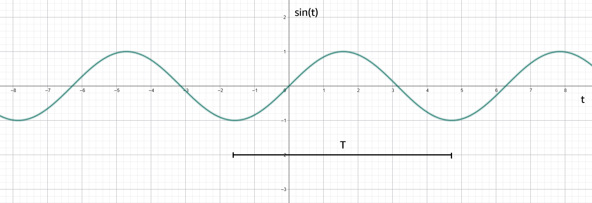

Funkcja taka z definicji jest nieskończona, ponieważ fala audio jest sygnałem analogowym. Aby można było badać sygnały
ciągłe w programie komputerowym należy przeprowadzić proces digitalizacji (składający się z dyskretyzacji oraz
kwantyzacji). Dyskretyzacja w dużym uproszczeniu polega na pobraniu skończonej liczby wartości referencyjnych wykresu w
zadanym przedziale czasu. Na sam proces dyskretyzacji sygnału mają wpływ następujące parametry:

* częstotliwość próbkowania $f_s$ (wyrażoną w Hz),
* okres próbkowania $T$ (czas między pobraniami kolejnych próbek sygnału, z zależnością $T=\frac{1}{f_s}$).

Według twierdzenia Nyquista-Shannona, aby możliwe było dokładne odtworzenie sygnału dyskretnego do sygnału ciągłego,
częstotliwość próbkowania powinna być co najmniej 2-krotnością częstotliwości dyskretyzowanego sygnału.

Z kolei kwantowanie to przypisywanie konkretnych wartości sygnału (oś $OY$) określonych najczęściej maksymalną
rozdzielczością bitową przetwornika (dla przykładu standardowa rozdzielczość bitowa kodeka
[Dolby Digital](https://pl.wikipedia.org/wiki/A/52) (pod nazwą kodową A/52) to 24bit, czyli posiada 24 poziomy
kwantyzacji. Im więcej poziomów kwantyzacji, tym odwzorowanie dźwięku jest lepsze, ale wymaga większej mocy
obliczeniowej procesora DSP (dla układów czasu rzeczywistego) i/lub pamięci (w przypadku zapisu cyfrowego).

Sygnał poddany dyskretyzacji oraz kwantyzacji jest nazywany czasami sygnałem schodkowym, w którym $\Delta$ oznacza
wysokość *schodka*, a więc pośrednio odległość kwantowania:

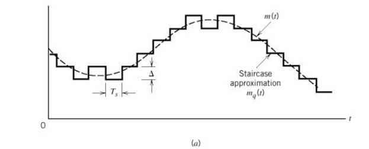

W przetwarzaniu dźwięku dominujące częstotliwości próbkowania to 44100 Hz i 48kHz. Wynika to z maksymalnego zakresu
słyszalnego dla człowieka, czyli około 20kHz. W przypadku 44100Hz częstotliwość ta jest powszechnie wykorzystywana w
MPEG-1 (MP3 oraz nośniki CD). Natomiast w zastosowaniach filmowych (takich jak np. kodowanie A/52) dominującą wartością
jest 48kHz z uwagi na prostszą synchronizację względem liczby klatek na sekundę — zazwyczaj 24). W podanych niżej
przykładach została wykorzystana częstotliwość 44100Hz.

## Sygnały sinusoidalne

Mając już wiedzę na temat dyskretnej reprezentacji sygnału, zmodyfikujmy więc klasyczną funkcję sinus na potrzeby
eksperymentu, tak aby przyjmowała zadaną wartość częstotliwości (np. 200Hz). W tym celu należy posłużyć się definicją
wzoru pulsacji:

$$
\omega = 2\pi f
$$

Wzór ten opisuje szybkość oscylacji powtarzającego się sygnału w funkcji czasu. Na poniższym rysunku przedstawione jest
odwzorowanie zapisu pulsacji na okręgu i odpowiadającej jej wartości funkcji sinusoidalnej. Jak wiadomo, liczba $\pi$
jest równa 180°. Mnożąc ją przez 2 otrzymamy pełen zakres obrotu. Modyfikując odpowiednio parametr $f$ można
przyspieszyć lub spowolnić prędkość oscylacji a tym samym zwiększyć bądź zmniejszyć okres sygnału sinusoidalnego (przy
takim samym czasie trwania sygnału).

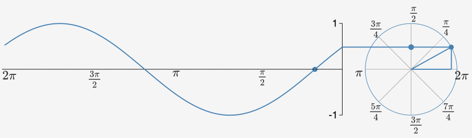

Więcej informacji o pulsacji i modulacji sygnału sinusoidalnego znajdziesz w tym artykule:
https://mathematicalmysteries.org/sine-wave.

Przykładowy skrypt w środowisku Matlab generujący sygnał sinusoidalny z zadanymi parametrami:

```matlab
f=200; % częstotliwość sygnału, Hz
fs=44100; % częstotliwość próbkowania, Hz
Ts=1/fs; % okres próbkowania
fname='sin200.wav'; % nazwa wynikowa pliku .wav

td=4; % czas trwania (sekundy)

t=0:Ts:td-Ts; % wektor czasu
y=sin(2*pi*f*t);

tds=t*1000; % konwersja na milisekundy

plot(tds,y);
xlim([0,10]); % ograniczenie osi OX 0..10 ms
ylim([-1,1]); % ograniczenie osi OY (amplituda)
grid on;

sound(y,fs); % odtworzenie dźwięku
audiowrite(fname,y,fs); % zapisanie do pliku
```

Przyjmując za częstotliwość próbkowania wartość 44100 Hz, częstotliwość sygnału 200Hz oraz czas trwania 4 sekundy,
generowany jest następujący przebieg:

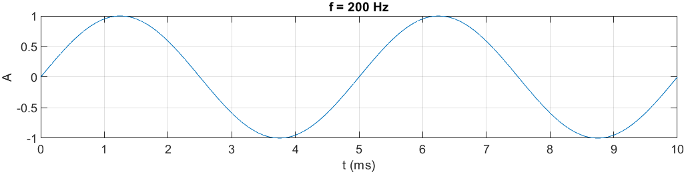

Próbka audio:

<audio controls>
  <source src="/podstawy-przetwarzania-i-analizy-częstotliwościowej-sygnału-audio/audio/sin200.wav" type="audio/wav" />
</audio>

Zmieńmy teraz częstotliwość sygnału na wyższą np. 800Hz:

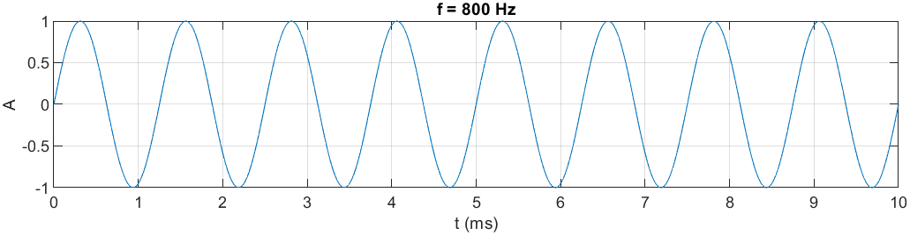

Próbka audio:

<audio controls>
  <source src="/podstawy-przetwarzania-i-analizy-częstotliwościowej-sygnału-audio/audio/sin800.wav" type="audio/wav" />
</audio>

Po odsłuchaniu próbek jest zauważalna różnica w wysokości dźwięku. Można wywnioskować, że im wyższa częstotliwość
dźwięku, tym wyższa jest jego wysokość. Odnosząc się do wcześniej omawianej pulsacji, zwiększanie wartości
częstotliwości powoduje szybszy czas pełnego obrotu i skrócenie okresu sygnału.

Dodajmy teraz dodatkowy parametr modyfikujący amplitudę:

```matlab
...
A=0.1; % amplituda
y=A*sin(2*pi*f*t);
...
```

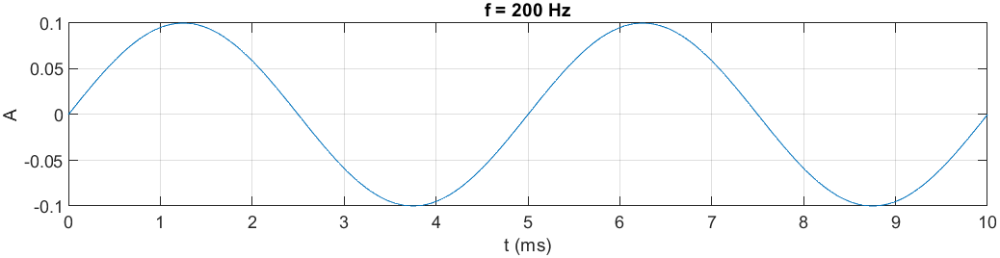

Próbka audio:

<audio controls>
  <source src="/podstawy-przetwarzania-i-analizy-częstotliwościowej-sygnału-audio/audio/sin200-amp.wav"
          type="audio/wav" />
</audio>

Zmniejszenie amplitudy wyraźnie osłabiło sygnał, przez co dźwięk stał się cichszy i przytłumiony. Analogicznie, podczas
stopniowego zwiększania amplitudy, dźwięk stanie się coraz głośniejszy aż do uzyskania tzw. przesterowania, czyli
zniekształceń (artefaktów) osiągalnych po przekroczeniu maksymalnego zakresu dynamicznego urządzenia, np. głośników.

Spróbujmy teraz dodać do siebie dwa sygnały, tak aby uzyskać sumę sygnałów. Można to zrealizować w środowisku Matlab
dodając kolejne składowe sygnału do siebie:

```matlab
A=0.1;
fs=44100;
Ts=1/fs;
td=4;
t=0:Ts:td-Ts;

yS = sine_sum([200,800],t,A);

function yS=sine_sum(f,t,A)
  yS=0;
  for i=1:length(f)
    yS=A*sin(2*pi*f(i)*t)+yS;
  end
end
```

Nałożone na siebie częstotliwości 200Hz (niebieskie) i 800Hz (pomarańczowe):

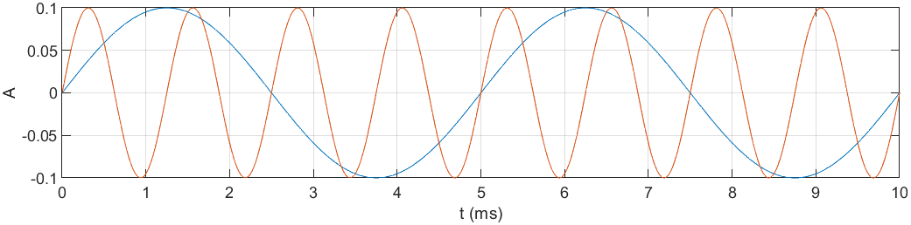

oraz zsumowane funkcje sinusoidalne o częstotliwościach 200Hz i 800Hz:

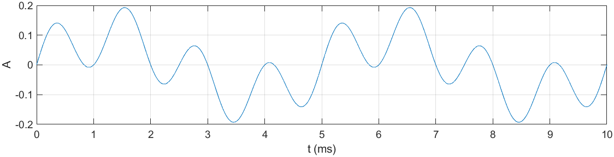

Próbka audio:

<audio controls>
  <source src="/podstawy-przetwarzania-i-analizy-częstotliwościowej-sygnału-audio/audio/sin200-800-sum.wav"
          type="audio/wav" />
</audio>

Po odsłuchaniu słychać wyraźne harmoniczne brzmienie dwóch częstotliwości. Widoczne jest również subtelne wzmocnienie
dźwięku, co potwierdza zwiększona wartość amplitudy na rysunku zsumowanych funkcji sinusoidalnych. Zwiększenie amplitudy
wynika z operacji sumowania jej składowych. Jak można zauważyć, w okolicach 1.5ms amplitudy 2 sygnałów osiągają
ekstremum (wynoszące około 0.1). Sumując te obie wartości otrzymamy wartość 0.2.

## Sygnały piłokształtne

Sygnały dźwiękowe można generować również poprzez inne funkcje matematyczne. Jedną z nich jest funkcja generująca sygnał
piłokształtny. Sygnał taki jest możliwy do stworzenia z wykorzystaniem funkcji
[sawtooth](https://www.mathworks.com/help/signal/ref/sawtooth.html?s_tid=doc_ta#d126e180881) dostępnej w rozszerzeniu
Signal Processing Toolbox (rozwiązanie płatne) bądź ręcznym jej zaprojektowaniu. W omawianym artykule stworzono funkcję
ręcznie:

```matlab
A=0.1; % amplituda
f=600; % częstotliwość sygnału
T=1/f; % okres sygnału

fs=44100; % częstotliwość próbkowania
Ts=1/fs; % okres próbkowania
td=4; % czas trwania (s)
t=0:Ts:td-Ts; % wektor czasowy

yS=A*(-2*abs(mod(t,T)/T-1)+1); % funkcja piłokształtna
```

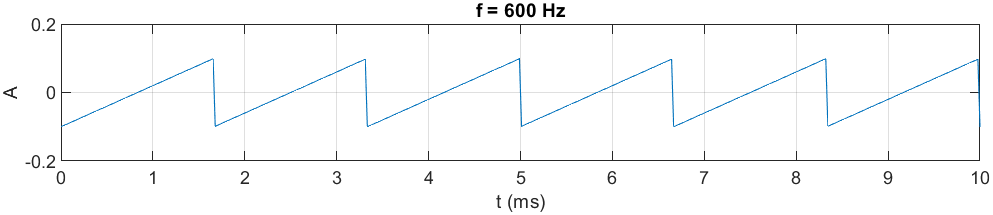

Próbka audio:

<audio controls>
  <source src="/podstawy-przetwarzania-i-analizy-częstotliwościowej-sygnału-audio/audio/saw600.wav"
          type="audio/wav" />
</audio>

Dźwięk uzyskany w wyniku działania takiej funkcji jest bardziej *ostry* i *wyrazisty* w przeciwieństwie do sygnałów
sinusoidalnych.

Sygnały piłokształtne podobnie jak sinusoidalne można ze sobą sumować. Do sumowania stworzono funkcję bliźniaczo podobną
do tej z funkcji sinusoidalnej i zastosowano ją dla częstotliwości sygnału 300Hz oraz 600Hz:

```matlab
A=0.1;
fs=44100;
Ts=1/fs;
td=4;
t=0:Ts:td-Ts;

yS=saw_sum([300,600],t,A);

function sS=saw_sum(f,t,A)
  sS=0;
  for i=1:length(f)
    T=1/f(i);
    sS=A*(-2*abs(mod(t,T)/T-1)+1)+sS;
  end
end
```

Nałożone na siebie funkcje piłokształtne o częstotliwościach 300Hz (niebieska) i 600Hz (pomarańczowa):

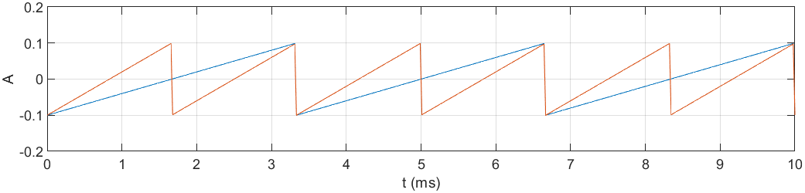

oraz zsumowane funkcje piłokształtne o częstotliwościach 300Hz i 600Hz.

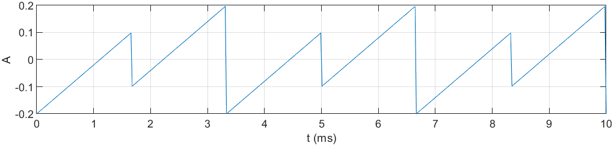

Próbka audio:

<audio controls>
  <source src="/podstawy-przetwarzania-i-analizy-częstotliwościowej-sygnału-audio/audio/saw300-600-sum.wav"
          type="audio/wav" />
</audio>

Podobnie jak w przypadku sygnału sinusoidalnego, amplituda sygnału piłokształtnego została zsumowana. Dobrze jest to
widoczne na pierwszym z powyższych rysunków: w okolicach 3.3ms oba sygnały osiągnęły maksymalną amplitudę 0.1. Po jej
zsumowaniu otrzymano wartość 0.2.

Spróbujmy teraz połączyć ze sobą dwie sumy sygnałów: sygnału sinusoidalnego ze składowymi częstotliwościowymi 200Hz oraz
800Hz i wcześniej wygenerowanego sygnału piłokształtnego 300Hz, oraz 600Hz. Łączenie to przebiega analogicznie do
addycji sygnałów tej samej funkcji:

```matlab
...
% parametry próbkowania i podstawowe parametry sygnału
...
fsin=[200,800]; % częstotliwości sinusoidalne
fsaw=[300,600]; % częstotliwości piłokształtne

ysinS=sine_sum(fsin,t,A);
ysawS=saw_sum(fsaw,t,A);

yS = ysinS+ysawS; % suma wszystkich sygnałów

...
function yS=sine_sum(f,t,A)
...
function sS=saw_sum(f,t,A)
...
```

Zsumowane sygnały sinusoidalne i piłokształtne (200Hz, 800Hz, 300Hz, 600Hz):

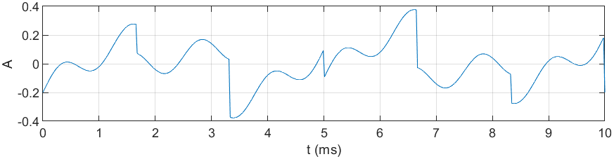

Próbka audio:

<audio controls>
  <source src="/podstawy-przetwarzania-i-analizy-częstotliwościowej-sygnału-audio/audio/sin-saw-sum.wav"
          type="audio/wav" />
</audio>

Dzięki takim zabiegom można wykonać bardzo ciekawe modulowane brzmienia, a nawet skomponować proceduralnie muzykę
elektroniczną.

Wróćmy natomiast do początku artykułu, gdzie poruszana była definicja fali dźwiękowej. Mając wiedzę z poprzednich
akapitów można stwierdzić, że każda fala dźwiękowa (przyjmując zakres słyszalny, tj. około 20Hz-20kHz) reprezentowana
jest jako suma prostych funkcji matematycznych. Co więcej, zgodnie z definicją twierdzenia szeregu Fouriera:

$$
\begin{align*}
f(x) &= \frac{1}{2} a_0 + \sum_{n=1}^{\infty} a_n \cos(nx) + \sum_{n=1}^{\infty} b_n \sin(nx) \\
a_0 &= \frac{1}{\pi} \int_{-\pi}^{\pi} f(x) \, dx \\
a_n &= \frac{1}{\pi} \int_{-\pi}^{\pi} f(x) \cos(nx) \, dx \\
b_n &= \frac{1}{\pi} \int_{-\pi}^{\pi} f(x) \sin(nx) \, dx
\end{align*}
$$

każdą funkcję okresową można zapisać jako sumę prostych funkcji sinusoidalnych (na przykład funkcję piłokształtną) o
zmiennych częstotliwościach. Cechę tą poniżej przestawiono na przykładzie aproksymacji sygnału piłokształtnego przy
użyciu szeregu Fouriera:

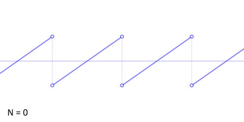

## Wstępna analiza utworu "Jezioro Łabędzie" Czajkowskiego

Na koniec przeanalizujmy przykładowy utwór
["Jezioro łabędzie Czajkowskiego": Akt II, nr 10](https://www.youtube.com/watch?v=do6Ki6kMq_o). Jego analizy w
oprogramowaniu Matlab można dokonać przy użyciu funkcji `audioread`, która jako argument przyjmuje nazwę pliku a jej dane
wyjściowe to próbki oraz częstotliwość próbkowania. Mając takie parametry można wykreślić zapis audio jako funkcję
$f(t)$:

```matlab
% wczytanie pliku
[samples,fs]=audioread('tchaikovsky-swan-lake.mp3');

sl=length(samples); % ilość próbek
t=(0:sl-1)/fs; % czas trwania

plot(t, samples);
xlabel('t (s)');
ylabel('A');
grid on;
```

Reprezentacja dźwięku w formie wykresu:

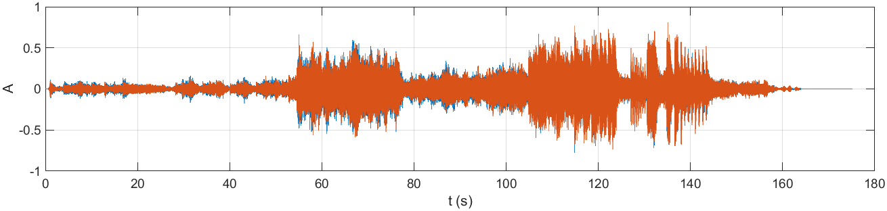

Jak widać na powyższym rysunku, dynamika utworu reprezentowana jest poprzez zmiany amplitudy (momenty cichsze i
głośniejsze). Po uważnym przyjrzeniu się wykresowi można dostrzec, że zawiera on dwie składowe: sygnał niebieski i
pomarańczowy. Wynika to z faktu, że analizowane nagranie jest zapisane w formacie stereofonicznym (2-kanałowym).
Rozdzielmy więc dwa kanały na dwa osobne wykresy:

```matlab
...
lch = samples(:,1); % lewy kanał
rch = samples(:,2); % prawy kanał

draw_plot(t,rch,1);
draw_plot(t,rch,2);

function draw_plot(t,samples,nr)
  subplot(2,1,nr);
  plot(t, samples);
  xlabel('t (s)');
  ylabel('A');
  grid on;
end
```

Lewy kanał:

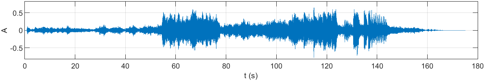

Prawy kanał:

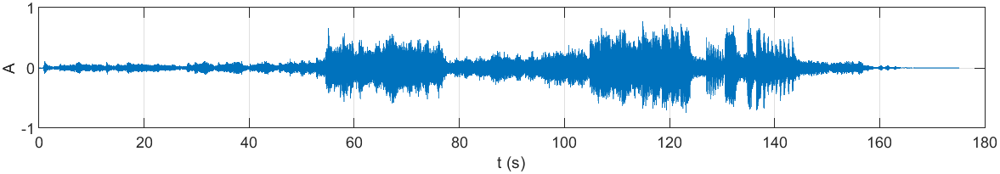

Jeśli dokonamy dużego przybliżenia na sygnał któregokolwiek kanału, zauważymy oscylacje podobne do tych uzyskanych w
wyniku dodawania kolejnych funkcji sinusoidalnych. Sygnał ten jest zatem połączeniem wielu prostych sinusoid o różnych
częstotliwościach.

Duże przybliżenie lewego kanału:

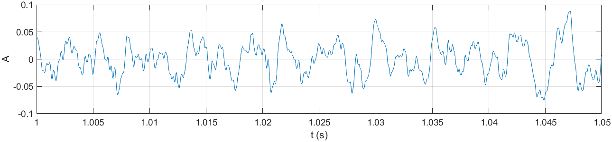

Duże przybliżenie prawego kanału:

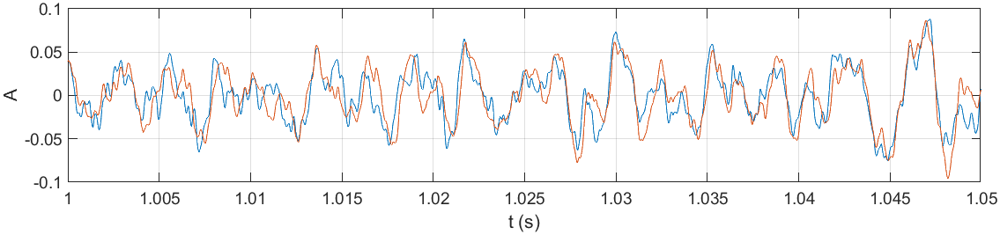

## Podsumowanie i wnioski

Artykuł ten pozwolił przedstawić podstawowe pojęcia z zakresu przetwarzania sygnału audio. Nakreślił on sposób
proceduralnego generowania dźwięku przy użyciu prostych funkcji matematycznych oraz generowanie coraz to bardziej
złożonych akordów z wykorzystaniem operacji sumowania sygnałów. Przedstawił on również podstawy szeregu Fouriera, dzięki
któremu dowolny sygnał audio można przedstawić jako reprezentację prostych funkcji sinusoidalnych o zmiennej
częstotliwości. Pod koniec przedstawiono wstęp do analizy utworu "Jezioro Łabędzie" Czajkowskiego.

Zrozumienie podstawowych pojęć z zakresu przetwarzania sygnału audio (w tym jego analizy) jest niezbędne do poznania
bardziej zaawansowanych technik używanych w celu dekompozycji oraz analizy częstotliwościowej mające bardzo szerokie
zastosowanie praktyczne wliczając w nie np. redukcję szumów czy kompresję.

## Bibliografia

* Smith W. Smith - Digital Signal Processing - A Practical Guide for Engineers and Scientists, 2007,
* https://www.mathworks.com/help/matlab,
* https://esezam.okno.pw.edu.pl/mod/book/tool/print/index.php?id=24&chapterid=295,
* http://www2.egr.uh.edu/~glover/applets/Sampling/Sampling.html,
* https://www.youtube.com/watch?v=9WZM68aVnGk,
* https://www.tutorialspoint.com/continuous-time-vs-discrete-time-sinusoidal-signal,
* https://developer.dolby.com/technology/dolby-audio/dolby-truehd,
* https://sound.eti.pg.gda.pl/~greg/dsp/06-GenerowanieSygnalow.html.
