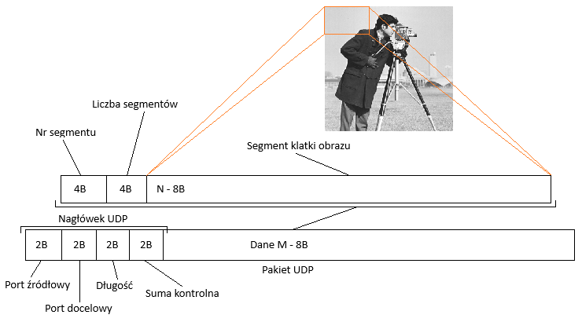
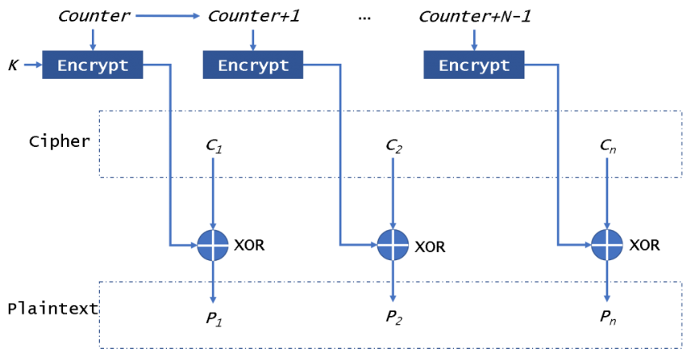
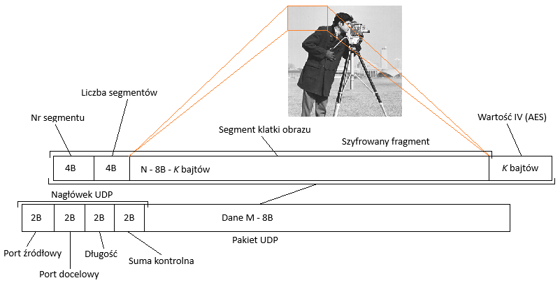
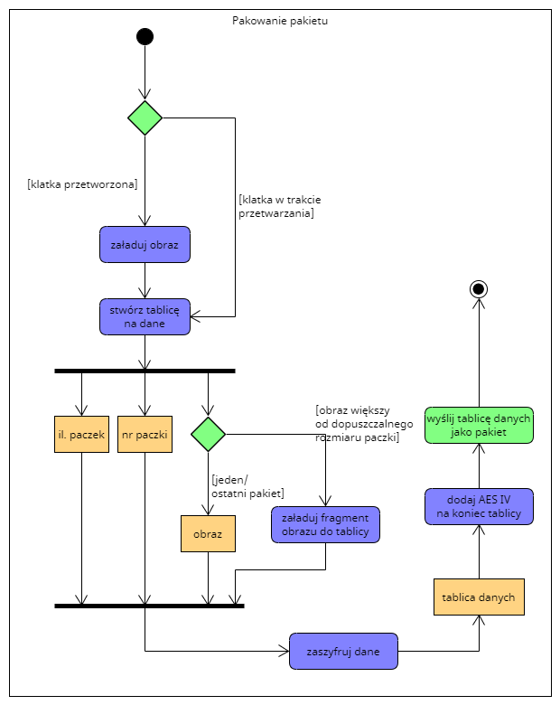
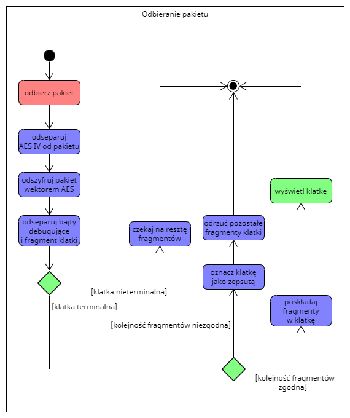

W tym wpisie chciałbym podzielić się moją przygodą w projektowaniu protokołu strumieniowego przesyłania obrazu. Protokół
powstawał jakiś czas temu na potrzeby projektu aplikacji do szyfrowanego strumieniowego przesyłania obrazu.

Skupię się tutaj bardziej na aspektach projektowych i algorytmicznych, toteż wszystkie implementacje będą w formie
pseudokodów i diagramów stanu. Nakreślę również problemy, jakie się w trakcie pojawiły (a trochę ich było).

Zakładam, że czytelnik ma podstawową wiedzę z zakresu sieci komputerowych, arytmetyki binarnej i kryptografii, toteż nie
wyjaśniam szczegółowo niektórych skrótów i terminów.

Zaznaczę również że jest to bardzo prosta i naiwna implementacja, niezbyt wydajna do realnych środowisk produkcyjnych,
mająca bardziej na celu pokazanie działania takich systemów od podstaw (skupię się tutaj głównie na warstwie 3, 4 i 7
modelu OSI).

## Kanał transportu danych: protokoły TCP/UDP

Projektując jakikolwiek protokół (czy to znany HTTP, FTP, czy protokół X) należy mieć na uwadzę, że pod maską zazwyczaj
korzysta on albo z protokołu TCP, albo z UDP, czyli z protokołu niższej warstwy. Wybierając protokół TCP albo UDP należy
mieć świadomość sposóbu ich działania. TCP lepiej nada się do danych mniej dynamicznych, ale takich, które muszą zostać
dostarczone w całości. UDP z kolei lepiej nada się do np. przesyłania strumieniowego audio czy wideo z uwagi na zerowy
narzut obliczeniowy związany z korekcją błędnych pakietów i ich retransmisją oraz brak 3-way-handshake jak ma to miejsce
w protokole TCP. Poprawność również nie jest priorytetowa (podobnie jak w metodach kompresji; efektywniejsze będzie
zastosowanie dla danych multimedialnych kompresji stratnych takich jak JPEG aniżeli LZ77).

> Ciekawostka: Najnowszy standard HTTP/3 jest oparty o protokół QUIC, który w warstwie 4 OSI korzysta z UDP. W celu
> korekcji błędów korzysta z własnych mechanizmów działających na poziomie warstwy 7. Zainteresowanych odsyłam do
> dokumentu RFC9000: https://datatracker.ietf.org/doc/html/rfc9000.

## Przesył danych (maksymalny rozmiar pakietu UDP, MTU i problemy z tym związane)

Wiedząc już, że do transmisji danych multimedialnych zostanie wykorzystane UDP, należy przyjrzeć się charakterystyce
tego protokołu. Przydatna będzie tutaj wiedza z podstaw arytmetyki binarnej i sieci komputerowych. Maksymalna pojemność
jednego pakietu dla UDP (w sensie transportowym) to 64kB dla IPv4 (skupię się tutaj jedynie na tym protokole, z uwagi na
jego szeroką dostępność, dla IPv6 dzięki wykorzystaniu pewnych mechanizmów, pojemność ta może być większa). Natomiast
maksymalne MTU w typowej sieci Ethernet to około 1500 bajtów (nagłówek IP + UDP). Jeśli wyślemy pakiet UDP większy niż
1460 bajtów (1500 bajtów: nagłówek IP), będzie musiał on zostać pofragmentowany na poziomie warstwy 3, co dodatkowo
wprowadzi narzut obliczeniowy. To, czy zdecydujemy się na większe pakiety w warstwie 7 i fragmentację w warstwie 3, czy
mniejsze pakiety warstwy 7 i ograniczenie fragmentacji w warstwie 3 zależy od zakresu wykorzystywania protokołu (inne
potrzeby będą w przypadku zamkniętego oprogramowania wewnątrz firmy, gdzie łącza takie jak VPN mogą zmniejszać MTU, a
inne w przypadku projektowania usługi streamingowej pokroju Twitch czy Discord dostępnej dla szerokiego grona odbiorców).

Chcąc przesyłać każdą klatkę obrazu osobno napotkamy pierwszy problem. Kompresując ją algorytmem JPEG, wielkość dla
danych HD będzie znacznie większa od maksymalnej pojemności pakietu UDP. Mamy w tym wypadku dwie opcje:

* zmniejszyć jakość obrazu do tej znanej z początków YouTube (144p, 240p) i transmitować każdą klatkę w jednym pakiecie,
* podzielić klatę na mniejsze segmenty i wprowadzić algorytm składania tych segmentów po stronie odbiorcy.

Rzecz jasna, opcja pierwsza jest kuriozalna i mało przewidywalna z uwagi na sposób działania algorytmów kompresji (obraz
o małej dynamice będzie ważył mniej niż taki z większą ilością detali). Należy sobie odpowiedzieć na pytanie, co się
stanie w momencie, gdy na obrazie mimo zastosowania najniższej z możliwych rozdzielczości poziom detali będzie tak duży,
że jedna klatka nie zmieści się w jednym pakiecie UDP?

Wykorzystajmy więc podział klatki na segmenty (fragmentacja w warstwie 7 OSI). Załóżmy, że pakiet UDP jest rozmiaru $M$
bajtów. Nagłówek UDP zajmuje $8$ bajtów, toteż dane zajmują $M - 8B = N$. Każdy segment (fragment jednej klatki obrazu)
będzie posiadał $N - 8$ bajtów. Pierwsze $4$ bajty będą przeznaczone na nr segmentu a drugie $4$ na maksymalną ilość
segmentów przypadających na jedną klatkę. Reszta będzie przypadała na dane segmentu. Obrazuje to poniższa ilustracja.



Ktoś mógłby zadać pytanie a co jeśli wartość nr segmentu albo liczby segmentów przekroczy 4 bajty. Wówczas doszłoby do
przepełnienia zakresu 32 bitów i w konsekwencji wstawianie zakłamanych wartości. W bardziej zaawansowanej implementacji
protokołu można wprowadzić specjalne terminatory oddzielające sekcje strukturę danych pakietu UDP albo wprowadzić
dodatkowe pole przechowujące ilość zadeklarowanych bajtów dla liczby segmentu i nr segmentu a same pola oznaczyć jako
pływające. Należy mieć na uwadze jednak to, że terminatory, czy pola mogą wprowadzić dodatkowy narzut obliczeniowy, co
może spowolnić transmisję segmentów. Wykonując pewne obliczenia, biorąc pod uwagę to, że musimy przesłać klatkę obrazu
$10MB$ (rozdzielczość 4K, 24-bitowa głębia koloru, kompresja JPEG na poziomie 90% jakości obrazu bazowego) zakładając
brak fragmentacji w warstwie 3 (maksymalny rozmiar danych: 1460 bajtów), wychodzi około 7182 segmentów (rzecz jasna,
przy użyciu fragmentacji w warstwie 3 liczba segmentów się zmniejsza; rysunek poniżej).

$$
\frac{10 \text{ MB}}{1460 \text{ B}} = \frac{10485760 \text{ B}}{1460 \text{ B}} \approx 7182 \text{ segmenty}
$$

Liczba ta mieści się na 2 bajtach, także 4 bajty to w zupełności bezpieczny rozmiar.

## Szyfrowanie strumienia danych

Wiedząc już jak będziemy fragmentaryzować dane i wysyłać je przez sieć, dodajmy do nich szyfrowanie. Znamy dwa główny
typy szyfrowania: asymetryczne i symetryczne. Asymetryczne wykorzystuje pary kluczy: publiczny i prywatny. Sam proces
szyfrowania odbywa się z wykorzystaniem klucza publicznego a deszyfrowania z wykorzystaniem klucza prywatnego. Jest ono
szeroko stosowane z uwagi na duże bezpieczeństwo, ale wprowadza dodatkowy narzut obliczeniowy co ma niemałe znaczenie w
przypadku budowania systemów czasu rzeczywistego. Szyfrowanie symetryczne natomiast korzysta tylko z jednego klucza.

W projektowaniu protokołu skorzystałem z szyfrowania symetrycznego AES w trybie CTR. CTR (Counter) jest to jeden z
trybów działania AES. Działa na zasadzie XOR-owania strumienia wygenerowanego przez licznik (counter) z danymi
wejściowymi. Nie bez powodu wykorzystałem tryb CTR. W przypadku danych strumieniowych sprawdzi się on najlepiej z uwagi
na:

* Brak modyfikacji długości danych wyjściowych w stosunku do danych wejściowych w wyniku szyfrowania oraz brak potrzeby
stosowania paddingu (wypełnienia) do wielokrotności 16 bajtów.
* Szybki proces szyfrowania i odszyfrowywania, ponieważ nie trzeba czekać na poprzednie bloki jak w trybie CBC —
wszystkie są od siebie niezależne. Dodaje to dodatkową zaletę możliwości przetwarzania współbieżnie wielu bloków dla
dużych segmentów.
* Jest bardziej bezpieczny od ECB z uwagi na wprowadzenie wektora inicjującego (IV) oraz licznika, co daje zapewnienie,
że dla tych samych danych wejściowych szyfrowanie będzie zawsze inne, nawet jeśli używa się tego samego klucza AES, z
uwagi na różne wartości licznika. Chroni to przed atakami wykorzystującymi powtarzalne wzorce w danych, a jak wiadomo
kolejne klatki obrazu są tego doskonałym przykładem (np. statyczny obraz przez kilka sekund).

Proces szyfrowania oraz deszyfrowania danych przedstawiony został na poniższych rysunkach. W celu uproszczenia schematu
counter jest traktowany jako licznik + wektor inicjujący (IV).




Więcej informacji na temat działania algorytmu AES i jego trybów znajdziesz na tej stronie:
https://www.highgo.ca/2019/08/08/the-difference-in-five-modes-in-the-aes-encryption-algorithm.

Tryb CTR zakłada, że wartość IV jest jawna i musi być przesłana wraz z danymi do odbiorcy w celu ich odszyfrowania.
Zmodyfikujmy więc strukturę danych UDP (rysunek poniżej). Wartość IV jest równa K, gdzie K to długość klucza AES
(zakładamy, że ma standardowo 128 bitów - 16 bajtów). Szyfrowany fragment datagramu obejmuje segment klatki obrazu,
wartość liczby segmentów oraz wartość numeru segmentu. Do tych zaszyfrowanych danych dodawany jest tekstem jawnym IV
(wektor początkowy).



Zakłada się, że klucz AES zostanie wysłany przez jakiś szyfrowany kanał komunikacji do osób zainteresowanych odbiorem
transmisji wideo. W moim programie sesja zabezpieczona była z wykorzystaniem szyfrowania asymetrycznego. Klucz AES do
deszyfrowania strumienia transmisji był uprzednio zaszyfrowany publicznym kluczem RSA i w takiej formie wysyłany był do
odbiorców. Można równie dobrze klucz AES wysłać poprzez Rest API schowane za reverse proxy z połączeniem TLS. Opcji jest
wiele, należy jednak pamiętać, żeby taki klucz wysyłać ZAWSZE szyfrowanym kanałem komunikacji i co jakiś czas go rotować
(najlepiej per-połączenie). Wypłynięcie klucza AES może narazić strumień na ataki MITM (man in the middle).

## Algorytm dzielenia obrazu na segmenty i wysyłanie datagramów przez kanał UDP

Wiedząc już, w jaki sposób należy dzielić dane i znając pojemności jednego pakietu UDP można skonstruować algorytm
służący do pobierania ówcześnie skompresowanej klatki obrazu zapisanej jako tablica bajtów i dzielenia jej na segmenty,
które to wraz z dodatkowymi danymi do walidacji po stronie odbiorcy zostaną dołączone do datagramu i wysłane kanałem
UDP. W implementacji zakładane jest, że kolejne segmenty wysyłane są przy użyciu mechanizmów wielowątkowości (tak, aby
nie blokować napływających kolejnych klatek obrazu).

Algorytm rozpoczyna od pobrania klatki obrazu jako tablicy bajtów. Następnie bazując na ilości bajtów w klatce obrazu i
maksymalnej ilości danych możliwych do zapełnienia w jednym datagramie, oblicza ilość potrzebnych segmentów do
przesłania jednej klatki obrazu. Jeśli liczba nieprzetworzonych danych jest większa od maksymalnej ilości danych
możliwych do zapełnienia w jednym datagramie, dzieli klatkę na segmenty (chunki), dodaje odpowiednio numer segmentu,
ilość segmentów na klatkę, dane obrazu z przesunięciem i szyfruje z wykorzystaniem wektora początkowego (IV) oraz
klucza AES. Gotowy datagram składa się z zaszyfrowanych danych oraz wektora początkowego. Datagram w takiej formie
wysyłany jest przez kanał UDP. Jeśli nieprzetworzonych danych jest mniej niż maksymalna pojemność datagramu (tj. jeśli
wszystkie dane mieszczą się w jednym datagramie) to wysyłany jest tylko jeden pakiet, po czym następuje pobranie
kolejnej klatki obrazu (zakończenie działania wątku wysyłającego segmenty).

```console
Dane wejściowe:
  N - maksymalna liczba bajtów możliwych do przesłania w jednym pakiecie
  sgNumS := 4 - liczba bajtów przeznaczona na numer segmentu.
  sgCountS := 4 - liczba bajtów przeznaczona na liczbę wszystkich segmentów.
  keyS := 16 - liczba bajtów przeznaczona na klucz AES (i tym samym IV).
  rawDataS := N - (sgNumS + sgCountS + keyS) - liczba bajtów dla segmentu.

dopóki napływają klatki obrazu:
  processingImage := pobierz pełną klatkę obrazu (jako tablicę bajtów)
  imageDataS := ilość bajtów w klatce obrazu
  sgCount := ceil(imageDataS / rawDataS)

  uprocessedDataS := imageDataS
  sendBytes := 0
  chunkOffset := 0
  sgNum := 0

  dopóki uprocessedDataS > rawDataS:
    datagram := [N - keyS]
    datagram += sgNum
    datagram += sgCount

    datagram += processingImage[chunkOffset o długość rawDataS]
    iv :=  wygeneruj losowy wektor inicjujący (IV)

    encDatagram := [N]
    encDatagram += zaszyfrowany datagram z użyciem klucza AES o rozmiarze keyS
    encDatagram += iv

    wyślij utworzony encDatagram przez kanał UDP

    sendBytes += N
    chunkOffset += rawDataS
    uprocessedDataS -= rawDataS
    sgNum += 1

  jeśli uprocessedDataS > 0:
    datagram := [uprocessedDataS + sgNumS + sgCountS]
    datagram += sgNum
    datagram += sgCount

    datagram += processingImage[chunkOffset o długość rawDataS]
    iv := wygeneruj losowy wektor inicjujący (IV)

    encDatagram := [uprocessedDataS + sgNumS + sgCountS + keyS]
    encDatagram += zaszyfrowany datagram z użyciem klucza AES o rozmiarze keyS
    encDatagram += iv

    wyślij utworzony encDatagram przez kanał UDP

    sendBytes += uprocessedDataS + sgNumS + sgCountS + keyS
    chunkOffset := 0
    uprocessedDataS := 0
    sgNum := 0
```



## Algorytm odbierania datagramów, walidacja błędnych klatek i składanie segmentów w klatki obrazu

Algorytm po stronie odbiorcy rozpoczyna od pobrania całego datagramu. Następnie wyłuskiwane jest z niego początkowe 16
bajtów wektora początkowego (IV). Z jego pomocą odszyfrowywana jest reszta datagramu. Z odszyfrowanego datagramu
pobierany jest numer segmentu, całkowita liczba segmentów oraz dane segmentu obrazu (dane obrazu dodawane są do bufora).
Jeśli wykryje, że segmenty są w niewłaściwej kolejności, ustawia całą klatkę jako corrupted (uszkodzoną). Jeśli
przesłano wszystkie segmenty i nie wykryto żadnego uszkodzonego segmentu, zawartość bufora jest pobierana w celu
wyświetlenia klatki obrazu a sam bufor jest czyszczony. Proces jest powtarzany, dopóki wątek jest aktywny.

```console
Dane wejściowe:
  N - maksymalna liczba bajtów możliwych do przesłania w jednym pakiecie
  sgNumS := 4 - liczba bajtów przeznaczona na numer segmentu.
  sgCountS := 4 - liczba bajtów przeznaczona na liczbę wszystkich segmentów.
  keyS := 16 - liczba bajtów przeznaczona na klucz AES (i tym samym IV).
  rawDataS := N - (sgNumS + sgCountS + keyS) - liczba bajtów dla segmentu.

sgNum := 0
prevSgNum := 0
sgCount := 0
imageBuffer := [] - bufor na segmenty jednej klatki obrazu
isCorrupted := false - czy klatka jest odrzucana (uszkodzony segment)
corruptedFrames := 0 - ilość uszkodzonych klatek

dopóki wątek jest aktywny:
  datagramData := odbierz zawartość datagramu
  datagramDataS := pobierz rozmiar odebranego datagramu

  iv := datagramData[N - keyS do końca]
  decDatagram := odszyfrowany datagram z użyciem klucza AES i IV

  sgNum := decDatagram[keyS, ilość sgNumS]
  sgCount := decDatagram[keyS + sgNumS, ilość sgCountS]

  imageBuffer += decDatagram[keyS + sgNumS + sgCountS, do końca]

  jeśli prevSgNum < sgNum - 1:
   isCorrupted := true

  prevSgNum := sgNum

  jeśli sgNum == sgCount:
   jeśli nie isCorrupted:
     wyświetl zawartość imageBuffer (pełna klatka)
   w przeciwnym wypadku:
     corruptedFrames += 1

    isCorrupted := false
    imageBuffer := [] - wyczyść bufor
```



## Podsumowanie

Przedstawiony prosty protokół przesyłania obrazu w czasie rzeczywistym z wykorzystaniem datagramów może w mniejszym lub
większym stopniu pokazać proces jego tworzenia od podstaw oraz uwidocznić obecność możliwych pułapek, na jakie można
natrafić podczas jego projektowania. W tego typu systemach należy mieć na uwadzę, że każdy cykl zegara procesora jest na
wagę złota i żeby działał on bez opóźnień należy unikać zbędnych deklaracji obiektów na stercie, tworzenia dużych tablic
a kopiowanie danych najlepiej realizować poprzez natywne funkcje. Projektując tego typu protokół można wysnuć pewne
złote zasady:

* UDP jest lepszym rozwiązaniem dla danych strumieniowych, mimo braku wbudowanych mechanizmów korekcji błędów. Najlepiej
takie mechanizmy napisać samemu.
* Podział danych na segmenty i ich wprowadzenie dodatkowych pól kontrolnych pozwalają na przesyłanie dużych klatek
obrazu w ograniczeniach wynikających z MTU i pojemności datagramów.
* AES w trybie CTR umożliwia szybkie szyfrowanie strumienia bez powiększania danych wyjściowych w stosunku do danych
wejściowych i jest bezpieczniejszy od trybu ECB z uwagi na obecność wektora inicjalizującego i licznika.

Jakby ktoś był ciekawy innych nieporuszonych szczegółów implementacyjnych, zapraszam do dyskusji w komentarzach.
