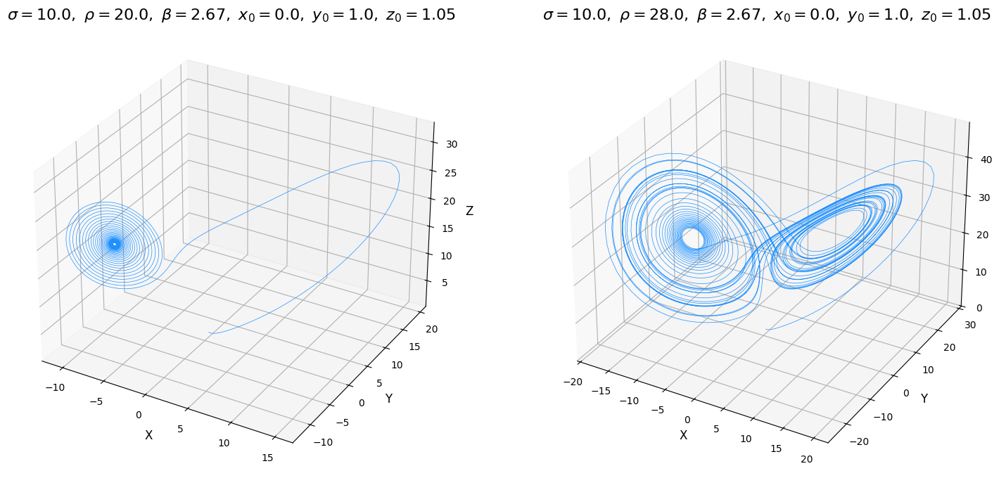
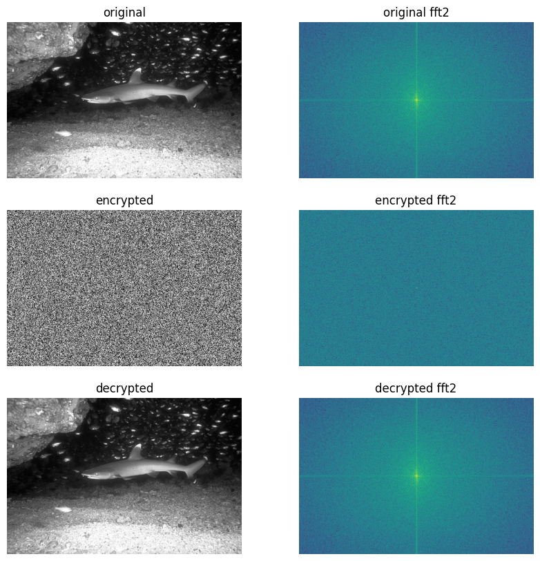

W tym wpisie chciałbym przybliżyć czym właściwie jest chaotyczny układ Lorenza, jaki ma on związek z deterministyczną
teorią chaosu oraz kryptografią. Jako że moje zainteresowania skupiają się wokół przetwarzania obrazów, przedstawię
tutaj wykorzystanie takiego układu chaotycznego w szyfrowaniu obrazów wraz z porównaniem widma 2DFFT, jednak nic nie
stoi na przeszkodzie, żeby szyfrować innego rodzaju dane cyfrowe. Rzecz jasna jest to bardzo prosta implementacja,
bez żadnych dodatkowych zabezpieczeń obecnych w rzeczywistych algorytmach kryptograficznych. Zakładam, że czytelnik ma
podstawową wiedzę matematyki wyższej, cyfrowego przetwarzania sygnałów (interpretacja 2DFFT) oraz programowania w
Pythonie.

## Osobliwy atraktor Lorenza, deterministyczna teoria chaosu i... efekt motyla

Czym właściwie jest ten atraktor Lorenza? Powstał on jako wynik próby stworzenia uproszczonego, matematycznego modelu
konwekcji atmosferycznej, czyli zjawiska leżącego u podstaw prognozowania pogody. Matematycznie, przedstawiany jest jako
układ 3 nieliniowych równań różniczkowych zwyczajnych:

$$
\begin{align*}
\begin{cases}
\frac{\partial x}{\partial t} &= \sigma(y-z) \\
\frac{\partial y}{\partial t} &= x(\rho-z)-y \\
\frac{\partial z}{\partial t} &= xy - \beta z
\end{cases}
\end{align*}
$$

Dla parametrów początkowych $x_0=0$, $y_0=1$, $z_0=1.05$ oraz $\sigma=10$, $\rho=28$ oraz $\beta=\frac{8}{3}$
trajektoria układa się w charakterystyczne skrzydła motyla. Istotna jest tutaj wartość w punkcie $\rho$, która definiuje
chaotyczność systemu (od wartości większej od około 24 system staje się chaotyczny, dla niższych, jest stabilny i dąży
do skoncentrowanego punktu). Istotne jest zatem odpowiednie ustawienie parametrów systemu, aby nie okazało się, że
trajektoria naszego atraktora zmierza do jednego skoncentrowanego punktu a tym samym jest bezużyteczna w zagadnieniach
kryptograficznych.



Atraktor Lorenza jest określany jako *dziwny* lub *osobliwy*. Oznacza to, że obiekt ten ma strukturę fraktalną i
niecałkowity (ułamkowy) wymiar. Jest to zatem obiekt bardziej złożony niż dwuwymiarowa powierzchnia, ale jednocześnie
nie wypełnia w pełni trójwymiarowej przestrzeni. Jego struktura jest nieskończenie złożona w każdej skali, a trajektoria
poruszająca się po nim wędruje bez końca, nigdy nie powracając do tego samego punktu ani nie przecinając własnej
ścieżki, co jest niespotykane w prostych atraktorach.

Najważniejszym odkryciem związanym z atraktorem Lorenza jest zjawisko chaosu deterministycznego. Oznacza to, że system,
mimo iż jest rządzony przez ścisłe, niezmienne prawa, w dłuższej perspektywie zachowuje się w sposób nieprzewidywalny.
Jest to spowodowane jego ekstremalną wrażliwością na warunki początkowe, co zyskało sławę jako spopularyzowany efekt
motyla. Koncepcja ta zakłada, że minimalna, praktycznie niemierzalna zmiana w punkcie startowym może po czasie
doprowadzić do lawinowo narastających, całkowicie odmiennych rezultatów. Zjawisko to przedstawione jest w filmie
[Butterfly effect](https://www.imdb.com/title/tt0289879/) z 2002 roku.

## Ale jak to się ma do kryptografii?

Współczesna kryptografia w dużej mierze opiera swoją potęgę na problemach matematycznych uważanych za trudne do
rozwiązania obliczeniowego. Algorytmy takie jak RSA wykorzystują fakt, że o ile pomnożenie dwóch ogromnych liczb
pierwszych jest proste, o tyle rozłożenie ich iloczynu z powrotem na czynniki pierwsze jest zadaniem nietrywialnym
(obecnie). Jest to przykład wykorzystania teorii liczb, lecz z powodzeniem w kryptografii można stosować zalety
nieprzewidywalności chaotycznych układów dynamicznych (np. omawiany wcześniej atraktor Lorenza).

Główna idea szyfrowania z wykorzystaniem chaotycznego układu Lorenza polega na tym, aby potraktować nieprzewidywalny,
ale w pełni odtwarzalny ciąg liczb generowany przez ten układ jako pseudolosowy klucz szyfrujący. W kryptografii idealny
klucz powinien być długi, niepowtarzalny i wyglądać jak losowy szum, aby uniemożliwić odgadnięcie jakichkolwiek wzorców.
Systemy chaotyczne, takie jak atraktor Lorenza, są niemal idealnymi generatorami takich właśnie sekwencji. Ponadto układ
Lorenza spełnia dwa fundamentalne założenia:

* duża wrażliwość na zmienne systemu a tym samym duża przestrzeń możliwych kluczy, gdzie samym kluczem są wartości
początkowe systemu; minimalna zmiana jednej z nich wygeneruje zupełnie nową i nieprzewidywalną sekwencję,
* determinizm, zapewniający możliwość utworzenia jednakowej sekwencji chaotycznej bazując na parametrach systemu i
wartościach początkowych (stanowiących klucz) jakimi te dane zostały zaszyfrowane umożliwiając proces odszyfrowania
danych.

## Implementacja generatora kluczy szyfrujących z wykorzystaniem solvera równań różniczkowych

Główna idea polega na potraktowaniu wartości początkowych jako klucza szyfrującego i deszyfrującego (podobnie jak w
AES). Jest to zatem szyfrowanie symetryczne. Wyznaczenie wyjścia układu chaotycznego z wykorzystaniem solvera równań
różniczkowych biblioteki `scipy` przedstawiono poniżej:

```python
import numpy as np
from scipy.integrate import solve_ivp

def lorenz_equations(t, state, sigma, rho, beta):
  x, y, z = state
  dx = sigma * (y - x)
  dy = x * (rho - z) - y
  dz = x * y - beta * z
  return [dx, dy, dz]

def solve_differential_equation(init_state, key_length, warmup_skip_count, sigma=10.0, rho=28.0, beta=8/3):
  # faza rozgrzewki, pobranie ostatniego punktu od którego rozpocznie
  # się właściwa faza wyznaczania wartości chaotycznych

  sol_warmup = solve_ivp(
    lambda _, y: lorenz_equations(y, sigma, rho, beta),
    t_span=[0, warmup_skip_count * 0.01],
    y0=init_state,
    method="RK45", # metoda Rungego-Kutty
  )
  last_warmup_point = sol_warmup.y[:, -1]

  # faza wyznaczania wartości chaotycznych od punktu last_warmup_point

  # długość dzielona przez 3, bo wyjście układu jest dla xyz
  t_end = int(np.ceil(key_length / 3))

  sol = solve_ivp(
    lambda _, y: lorenz_equations(y, sigma, rho, beta),
    t_span=[0, t_end * 0.01],
    y0=last_warmup_point, # punkt startowy po rozgrzewce
    method="RK45",
    t_eval=np.linspace(0, t_end * 0.01, t_end),
  )
  # spłaszcz do jednowymiarowej tablicy i odrzuć wartości spoza zakresu
  return sol.y.flatten()[:key_length]
```

Wyjście układu dla parametrów:

```python
key_length = 20
init_state = [2.3, 3.23, 1.16]
```

wygląda następująco:

```console
-12.4543573, -12.12129929, -11.70554096, -11.22002774,
-10.67954706, -10.10014729,  -9.49737409,  -9.98704406,
-8.89502371,  -7.82200793,  -6.80089914,  -5.85785985,
-5.01180416,  -4.27354616,  34.69201036,  34.96260791,
35.03592786,  34.92505809,  34.65020696,  34.23667234
```

Istotny w tym kodzie jest fragment, w którym odrzucane jest N pierwszych wyników obliczeń (zmienna `warmup_skip_count`)
z uwagi na fakt dużej przewidywalności rezultatów a tym samym niebezpieczeństwo złamania klucza. Liczba wartości do
odrzucenia może być określona przez:

* odwrotność maksymalnego wykładnika Lapunowa ($\frac{1}{\lambda_{\text{max}}}$), czyli czas Lapunowa pomnożonego przez
stałą wartość (z przedziału 5-10) i podzieloną przez krok symulacji (w przykładzie wynoszącym 0.01),
* techniki heurystyczne, bazując na wcześniejszej wiedzy w zachowaniu trajektorii atraktora.

### Wyznaczanie liczby pomijalnych wartości początkowych przy użyciu odwrotności maksymalnego wykładnika Lapunowa

Główna idea wyznaczania liczby pomijalnych wartości polega na śledzeniu dwóch trajektorii, jednej normalnej (opisanej
równaniami Lorenza) a drugiej zaburzonej. Ewolucja tego zaburzenia opisana jest przez równania wariacyjne:

$$
\begin{align*}
\begin{bmatrix}
\frac{\partial (\delta x)}{\partial t} \\
\frac{\partial (\delta y)}{\partial t} \\
\frac{\partial (\delta z)}{\partial t}
\end{bmatrix}
=
\textit{\textbf{J}}
\begin{bmatrix}
\delta x \\
\delta y \\
\delta z
\end{bmatrix},
\quad \textit{\textbf{J}} =
\begin{bmatrix}
-\sigma & \sigma & 0 \\
\rho-z & -1 & -x \\
y & x & -\beta
\end{bmatrix}
\end{align*}
$$

gdzie $\textit{\textbf{J}}$ to macierz Jakobiego stanowiącą liniowe przybliżenie nieliniowych zasad, które działa tylko
w nieskończenie małym otoczeniu punktu x (bo tylko ten punkt uwzględniony jest w wektorze zaburzeń).

Samo wyznaczenie maksymalnego wykładnika Lapunowa polega na akumulowaniu kolejnych wartości logarytmu naturalnego z
długości euklidesowej punktów $x$, $y$, $z$ obliczonych z równań wariacyjnych przy pomocy solvera dla kroku całkowania
$\tau$. Realizowane jest zgodnie ze wzorem, gdzie $N$ to maksymalna liczba kroków:

$$
\begin{align*}
\lambda_{\text{max}} &= \frac{1}{N \tau} \sum_{i=1}^{N} \ln(d_i), \\
\text{gdzie } d_i &= \sqrt{(\delta x_i)^2 + (\delta y_i)^2 + (\delta z_i)^2}
\end{align*}
$$

Poniżej znajduje się kod służący do obliczania ilości wartości do odrzucenia bazując na odwrotności maksymalnego
wykładnika Lapunowa. W pierwszym kroku odrzucane jest (heurystycznie) 100 pierwszych wyników, kiedy trajektoria wchodzi
na właściwy chaotyczny tor.

```python
import numpy as np
from scipy.integrate import solve_ivp

def lorenz_variational(state, sigma, rho, beta):
  x, y, z = state[:3] # wektor stanu [x, y, z]
  d_vec = state[3:] # wektor zaburzenia [dx, dy, dz]

  # trajektoria główna
  main_trajectory = lorenz_equations((x, y, z), sigma, rho, beta)

  # macierz Jakobiego
  J = np.array([
    [-sigma, sigma, 0],
    [rho - z, -1, -x],
    [y, x, -beta]
  ])
  d_vecdt = J @ d_vec # J * d_vec (równania wariacyjne)

  return np.concatenate((main_trajectory, d_vecdt))

def calculate_warmup_skip_count(init_state, warmup_time=100, n_steps=15000, tau=0.1, key_step=0.01, safe_mult=10,
                                sigma=10.0, rho=28.0, beta=8/3):
  sol_warmup = solve_ivp(
    lambda _, y: lorenz_equations(y, sigma, rho, beta),
    t_span=[0, warmup_time],
    y0=init_state,
    method="RK45",
  )
  main_trajectory_start = sol_warmup.y[:, -1]

  # wektor zaburzenia tylko dla parametru x
  perturbation_start = np.array([1.0, 0.0, 0.0])
  combined_state = np.concatenate(
    (main_trajectory_start, perturbation_start)
  )

  lapunov_sum = 0.0
  for _ in range(n_steps):
    sol_step = solve_ivp(
      lambda _, y: lorenz_variational(y, sigma, rho, beta),
      t_span=[0, tau],
      y0=combined_state,
      t_eval=[tau],
    )
    combined_state = sol_step.y[:, 0]
    final_perturbation = combined_state[3:]

    # obliczenie długości wektora zaburzenia
    norm = np.linalg.norm(final_perturbation)
    if norm > 0:
      lapunov_sum += np.log(norm)

    # renormalizacja, wektor początkowy następnego kroku
    combined_state[3:] = final_perturbation / norm

  mle = lapunov_sum / (n_steps * tau) # maksymalny wykładnik Lapunowa
  lyapunov_time = 1 / mle # czas Lapunowa

  # obliczenie wartości do odrzucenia mnożąc czas Lapunowa
  # przez bezpieczny mnożnik
  return int(np.ceil(lyapunov_time * safe_mult / key_step))
```

### Normalizacja klucza do tablicy bajtów

Wyjście układu (a więc wyjście obliczonych wartości solvera równań różniczkowych) nie nadaje się bezpośrednio do użycia
jako klucz i należy ją przetworzyć zgodnie z poniższymi krokami:

1. wyodrębnienie części ułamkowej (część całkowita jest mniej losowa niż część ułamkowa),
2. przeskalowanie o dużą wartość (np. $1e^10$) w celu wzmocnienia drobnych różnic między wartościami z solvera,
3. przekształcenie wartości (z wykorzystaniem operacji modulo) na zakres 8 bitów (0-255).

Poniżej znajduje się kod realizujący powyższe założenia, zakładając że `solver_out` to tablica rezultatów obliczeń `dx`,
`dy` oraz `dz` z funkcji `solve_differential_equation`:

```python
import numpy as np

def create_stream_key(solver_out):
  # pobierz jedynie wartości ułamkowe
  fractions_only = np.abs(solver_out - np.floor(solver_out))
  # przeskaluj o dużą wartość
  fractions_only *= 1e10
  # normalizuj do 8 bitów
  key_as_bytes = np.floor(fractions_only) % 256
  return key_as_bytes.astype(np.uint8)
```

Rezultatem jest następująca tablica bajtów (dla zadanych wcześniej parametrów początkowych oraz długości klucza równej
20):

```console
 array([221, 138,  97, 130, 242,  83, 175,  87, 112,  14,  58, 180, 209,
        75, 146, 137,  56, 177, 132,  76], dtype=uint8)
```

## Szyfrowanie strumieniowe z wykorzystaniem wartości nonce i operacji XOR

Mając już klucz w postaci tablicy bajtów można zaszyfrować dane z wykorzystaniem techniki szyfrowania strumieniowego.
Metoda ta zakłada, że klucz jest tej samej długości co dane i jest używany **TYLKO RAZ**. Tutaj pojawia się paradoks, bo
z założenia układ Lorenza jest deterministyczny i przy każdym kolejnym szyfrowaniu należałoby zmieniać parametry
początkowe, żeby nie używać wiele razy tego samego klucza. Rozwiązaniem jest tutaj specjalna jawna i pseudolosowa
wartość nonce dodawana do początkowych parametrów układu chaotycznego. Co istotne, wartość ta nigdy nie jest taka sama
dla kolejnych szyfrowań. Kod realizujący mieszanie wartości nonce ze stanem początkowym systemu tworzącą liczby
zmiennoprzecinkowe o dużej precyzji:

```python
import hashlib
import struct

def add_nonce_to_init_state(init_state, nonce):
  key_string = str(init_state)

  # łączenie klucza (init_state) z nonce oddzielając separatorem
  data_to_hash = key_string.encode('utf-8') + b"|" + nonce

  # hashowanie połączonego stringa
  h = hashlib.sha256(data_to_hash)
  digest = h.digest()

  # bezpieczne zakresy dla warunków początkowych
  min_val, max_val = -20.0, 20.0

  coords = []
  # 3 części po 8 bajtów, reszta ignorowana
  for i in range(3):
    chunk = digest[i*8 : (i+1)*8] # jedna współrzędna 8 bajtów
    # konwersja na duża liczbę całkowitą (big-endian)
    large_int = struct.unpack('>Q', chunk)[0]

    # normalizacja do zakresu 0 do 1, wartość maksymalna: 2^64 - 1
    normalized_val = large_int / (2**64 - 1)

    # skalowanie do przyjętego zakresu
    final_coord = min_val + (max_val - min_val) * normalized_val
    coords.append(final_coord)

  return coords
```

Ostatecznie można skonstruować dwie funkcje: `encrypt` i `decrypt` służącą do szyfrowania i deszyfrowania danych w
formie jednowymiarowej tablicy bajtów wykorzystującej wcześniej przytoczone funkcję oraz operację XOR:

```python
import os

def encrypt_decrypt(data, init_seed, nonce, data_length=None):
  if not data_length:
    data_length = len(data)

  # dodaj do sekretnego klucza (parametry początkowe) wartość nonce
  key_with_nonce = add_nonce_to_init_state(init_seed, nonce)

  # oblicz ilość elementów początkowych elementów do pominięcia
  skip_length = calculate_warmup_skip_count(key_with_nonce)

  # rozwiązanie układu równań Lorenza i utworzenie
  # strumieniowego klucza szyfrującego jako tablicy bajtów
  out = solve_differential_equation(init_seed, data_length, skip_length)
  key_stream = create_stream_key(out)

  encrypted_decrypted_data = [
    b_data ^ b_key for b_data, b_key in zip(data, key_stream)
  ]
  return bytes(encrypted_decrypted_data)

def encrypt(decrypted_data, init_seed, data_length=None):
  # pseudolosowa wartość generowana przy każdym szyfrowaniu
  nonce = os.urandom(16)
  encrypted_data = encrypt_decrypt(decrypted_data, init_seed, nonce, data_length)

  return nonce, encrypted_data

def decrypt(encrypted_data, init_seed, nonce, data_length=None):
  decrypted_data = encrypt_decrypt(encrypted_data, init_seed, nonce, data_length)
  return decrypted_data
```

Dla celów optymalizacyjnych można wyodrębnić funkcję `calculate_warmup_skip_count` i uruchamiać tylko raz z uwagi na
fakt, że liczba pomijalnych wartości nie zmieni się, nawet jeśli liczba danych wejściowych, a tym samym długość klucza
ulegnie zmianie.

## Przykład prostego szyfrowania i deszyfrowania tekstu

```python
init_state = [2.3, 3.23, 1.16]

data = "Sekretny szyfr"
data = data.encode("utf-8")

nonce, encrypted_data = encrypt(data, init_state)
print(f"encrypted: {encrypted_data.hex()}")

decrypted_data = decrypt(encrypted_data, init_state, nonce)
print(f"decrypted: {decrypted_data.decode("utf-8")}")
```

Rezultat:

```console
encrypted: d99bd7ae3a1e6b6a425d18f7b40a
decrypted: Sekretny szyfr
```

## Przykład szyfrowania i deszyfrowania obrazu

W przypadku obrazów sprawa się nieco komplikuje, ponieważ funkcja szyfrująca/deszyfrująca przyjmuje jednowymiarową
tablicę bajtów. Najprościej jest spłaszczyć dane obrazu 2D na jeden wymiar, a następnie (po procesie
szyfrowania/deszyfrowania) poddać rekonstrukcji na 2 wymiary (lub dla obrazów RGB na 3 wymiary) z wykorzystaniem
informacji o rozmiarze oryginalnego obrazu.

```python
import numpy as np
from scipy.fft import fft2, fftshift
from skimage import io

init_state = [2.3, 3.23, 1.16]

image = io.imread("../input/306052.png")

I = np.array(image)
I_1d = I.flatten() # spłaszczanie obrazu do jednego wymiaru

nonce, encrypted_image_1d = encrypt(I_1d, init_state)
decrypted_image_1d = decrypt(encrypted_image_1d, init_state, nonce)

# rekonstrukcja do 2 wymiarów (w, h)
I_encrypted = np.frombuffer(encrypted_image_1d, dtype=np.uint8).reshape(I.shape)
I_decrypted = np.frombuffer(decrypted_image_1d, dtype=np.uint8).reshape(I.shape)

def get_magnitude_spectrum(image):
  f_transform = fft2(image)
  # przesunięcie DC do środka obrazu
  f_transform_shifted = fftshift(f_transform)
  # +1 aby uniknąć log(0)
  return np.log(np.abs(f_transform_shifted) + 1)

I_mag_spect = get_magnitude_spectrum(I)
I_encrypted_mag_spect = get_magnitude_spectrum(I_encrypted)
I_decrypted_mag_spect = get_magnitude_spectrum(I_decrypted)
```

Analizując wyniki szyfrowania testowego obrazu oraz widmo Fouriera, proces szyfrowania całkowicie zniszczył jakiekolwiek
korelacje obrazu pierwotnego a jego energia jest równomiernie rozproszona po wszystkich częstotliwościach tworząc obraz
o właściwościach statystycznych losowego szumu (*encrypted fft2*).



## Podsumowanie

W tym wpisie przedstawiony został hipotetyczny sposób wykorzystania deterministycznego układu chaotycznego Lorenza w
kryptografii. Są to jednak czyste dywagacje i nie zalecam stosowania tego do celów produkcyjnych z uwagi na brak
dodatkowych rygorystycznych testów statystycznych (np. NIST STS). Jest to jednak (według mnie) ciekawe podejście do
generowania deterministycznych ciągów pseudolosowych. Standardowo, zapraszam do dyskusji w komentarzach.

Cały kod źródłowy w wygodnej formie notatników Jupyter znajduje się w repozytorium
[image-encryption-lorenz-attractor](https://github.com/milosz08/image-encryption-lorenz-attractor) na moim koncie
GitHub.
