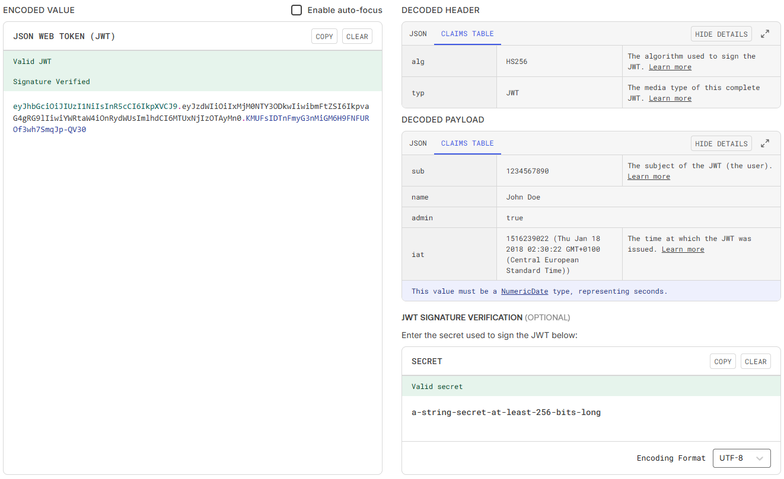
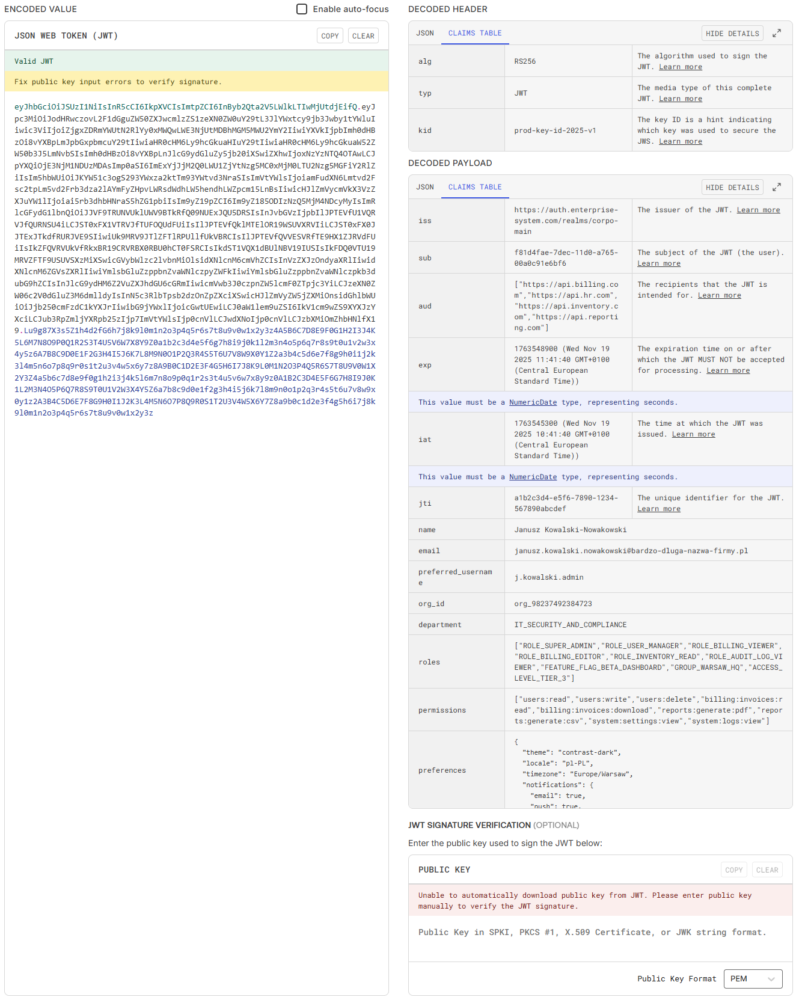
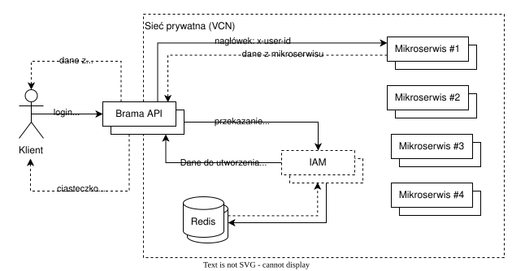

Wchodzisz na YouTube, szukasz tutoriala do autoryzacji w swoim ulubionym frameworku i co widzisz? JWT. Wszędzie JWT.
JSON Web Token stał się w ostatnich latach *złotym młotkiem* web developmentu (zwłaszcza wśród tutoriali dla
początkujących). Traktujemy go jako domyślny standard dla wszystkiego, co wymaga logowania. Obiecuje nam skalowalność,
brak stanu (statelessness) i nowoczesność. Wbrew pozorom, te zalety są jednocześnie największymi wadami tego
rozwiązania.

W tym wpisie przyjrzę się bliżej mechanizmom uwierzytelniania. Wyjaśnię, dlaczego w wielu scenariuszach (nawet w
architekturze rozproszonej) klasyczna sesja oparta na ciasteczkach pozostaje rozwiązaniem nie tylko prostszym w
implementacji, ale i bezpieczniejszym niż popularne alternatywy.

## JWT, czyli JSON Web Token

Zacznijmy od przypomnienia, jak właściwie ta technologia działa. Nie będę tutaj wchodził w szczegóły kryptograficzne, bo
zakładam, że czytelnik wie (mniej lub więcej) czym jest JWT. Każdy JWT podzielony jest na:

* **header** (nagłówek),
* **payload** (dosłownie *ładunek*, informacje identyfikacyjne),
* **signature** (sygnatura, podpis zapewniający integralność tokena).

Nagłówek zazwyczaj zawiera typ tokena (JWT) i wykorzystywany algorytm szyfrowania (np. HS256, RS256). W ładunku znajdują
się właściwe informacje (w branżowej nomenklaturze przyjęło się je określać mianem *claims*) obejmujące wydawcę (`iss`),
datę podpisania (`iat`), datę wygaśnięcia (`exp`), podmiot/użytkownika, dla którego wystawiono token (`sub`) oraz własne
dane aplikacji (najczęściej jakiś `userId` wiążący token z konkretnym użytkownikiem w bazie). Sygnatura to w dużym
skrócie mechanizm chroniący token w sposób dwojaki:

* zapewnia integralność danych, a więc weryfikuje, czy token nie został w żaden sposób zmieniony po jego wydaniu (jeśli
użytkownik spróbuje zmienić cokolwiek w nagłówku lub ładunku np. wartość `userId` żeby uwierzytelnić się jako kto inny
serwer podczas weryfikacji zauważy inny skrót, co poskutkuje odrzuceniem tokena),
* uwierzytelnia wystawcę przy użyciu tajnego klucza, udowodniając, że token został wystawiony przez zaufany podmiot
(czyli serwer, który zna klucz).

Końcowo dane te (w formacie JSON) są kodowane w formacie Base64, a więc przyjaznym dla adresów URL. Przykładowy
zakodowany oraz odkodowany JWT przedstawia poniższy rysunek (ze strony [jwt.io](https://www.jwt.io/)).

Należy pamiętać, że payload w JWT jest jawny. Ponieważ jest on jedynie zakodowany (Base64), a nie zaszyfrowany, każdy
posiadacz tokena może bez trudu odczytać jego zawartość. Z tego powodu umieszczanie w nim sekwencyjnego `userId` (np.
auto-inkrementowanego ID z bazy) jest ryzykowne – pozwala to atakującemu na łatwe zgadywanie identyfikatorów innych
użytkowników (tzw. *enumeration attack*). Jeśli trzeba przekazać identyfikator, należy użyć losowego ciągu znaków,
takiego jak UUID, który jest znacznie trudniejszy do przewidzenia. Oczywiście, przechowywanie w payloadzie haseł czy
innych danych poufnych jest absolutnie niedopuszczalne i stanowi krytyczną lukę bezpieczeństwa.

Więcej informacji o sposobie generowanie sygnatury można znaleźć w oficjalnym dokumencie
[RFC7515](https://www.rfc-editor.org/rfc/rfc7515). Pełną specyfikację JWT wraz z dokładnym opisem technicznym można
znaleźć w dokumencie [RFC7519](https://www.rfc-editor.org/rfc/rfc7519).

## Dlaczego wszyscy to pokochali?

JWT nie wzięło się znikąd i ma swoje mocne strony, które sprawiły, że zyskało ogromną popularność. To właśnie one są
często prezentowane w tutorialach jako *zabójcze cechy*:

* Bezstanowość (*stateless*) to największy atut JWT. Serwer nie musi utrzymywać żadnego stanu sesji dla użytkownika. Nie
przechowuje w pamięci ani w bazie danych informacji o zalogowanych użytkownikach. Wystarczy, że otrzyma token,
zweryfikuje podpis i odczyta dane.
* Brak konieczności utrzymywania stanu sesji znacząco ułatwia skalowanie aplikacji. Można dodawać i usuwać instancje
serwera bez martwienia się o synchronizację sesji, co jest dużym plusem w środowiskach chmurowych czy architekturze
mikroserwisowej.
* JWT łatwo integruje się z aplikacjami mobilnymi i SPA, które często komunikują się z API poprzez nagłówki
autoryzacyjne a niekoniecznie poprzez mechanizm cookie.
* Łatwość przekazywania informacji o podmiocie, dla którego wystawiono token, zwłaszcza w architekturze mikroserwisowej
między różnymi usługami bez konieczności każdorazowej weryfikacji z centralnym systemem uwierzytelniania.

To wszystko brzmi świetnie, lecz niestety, jak to mówią, *diabeł tkwi w szczegółach*.

## Problem nr 1: Brak możliwości *wylogowania* (unieważnianie tokenów)

To jest prawdopodobnie największa i najbardziej istotna wada JWT w typowych zastosowaniach. Serwer po wydaniu tokena go
*zapomina*. Token jest ważny aż do momentu wygaśnięcia, niezależnie od tego, co dzieje się później.

Wyobraźmy sobie, że użytkownik podejrzewa, że jego konto zostało przejęte, albo co gorsza – zgubił telefon, na którym
był zalogowany. W tradycyjnym systemie użytkownik loguje się z innego urządzenia i unieważnia sesję w bazie danych, a
tym samym jest natychmiast wylogowywany ze wszystkich (lub wskazanych) urządzeń. Jeśli używa się wyłącznie krótkich,
samowystarczalnych *access tokenów*, trzeba czekać, aż każdy z nich wygaśnie. Jeśli token ma żywotność 15 minut, to
przez kwadrans potencjalny atakujący może działać na koncie użytkownika.

Aby rozwiązać ten problem, wprowadzana jest często tzw. *czarna lista* unieważnionych tokenów, przechowywana np. w
Redisie. Co to oznacza? O ironio właśnie z powrotem zatoczyliśmy koło i wprowadziliśmy stan na serwerze. Traci się zatem
największą zaletę JWT (bezstanowość) i jednocześnie zwiększa się skomplikowanie systemu, bo trzeba zarządzać dodatkową
bazą danych do przechowywania unieważnionych tokenów i mechanizmami sprawdzania ich dla każdego zapytania w jakiś
dedykowanych middleware'ach lub autoryzacyjnych serwerach proxy.

## Problem nr 2: Gdzie to trzymać? (*local storage* kontra ciasteczka)

To jest odwieczny bój, który często kończy się kompromisem, ale rzadko idealnym rozwiązaniem dla bezpieczeństwa.
*Local storage* (i *session storage*) to ulubione miejsce wielu tutoriali, bo jest proste. Wygenerowany przez serwer
token umieszczany jest tam po zalogowaniu i pobierany każdorazowo przy zapytaniu do serwera API. Jaki jest natomiast
problem z tym rozwiązaniem? *Local storage* jest podatne na ataki XSS. Jeśli na stronie znajdzie się choćby mała,
niewinna luka XSS (np. źle zwalidowane dane wejściowe w komentarzach), złośliwy skrypt może łatwo odczytać token i
wysłać go atakującemu. A atakujący, posiadając token, może przejąć sesję. Wyjątkiem są tutaj natywne aplikacje mobilne,
gdzie zamiast podatnego na ataki *local storage* należy korzystać z bezpiecznych, szyfrowanych magazynów systemowych
(takich jak iOS Keychain czy Android Keystore).

Alternatywa, która oferuje znacznie większe bezpieczeństwo to znany z klasycznej sesji mechanizm cookie. Tutaj natomiast
zawartością nie jest SID (*session id*), lecz sam zakodowany w Base64 JWT. Warto tutaj nadmienić, że aby to rozwiązanie
miało jakikolwiek sens, ciasteczka powinny być z flagą `HttpOnly` a tym samym być niedostępne dla JavaScriptu
uruchamianego w przeglądarce (nagminnie można zauważyć brak tej flagi wynikające albo z niewiedzy, albo z wygody, by móc
odczytywać JWT przez klienta JavaScript, co jest dużą luką bezpieczeństwa). Oznacza to, że nawet jeśli na stronie
dojdzie do ataku XSS, złośliwy skrypt nie będzie w stanie odczytać tokena. Brzmi idealnie? Prawie, oprócz jednego
subtelnego problemu. Ciasteczka `HttpOnly` są podatne na ataki CSRF, ale można się przed nimi bronić np. za pomocą
tokenów CSRF oraz poprzez ustawienie dla ciasteczka atrybutu `SameSite`.

I tutaj znowu zataczamy koło, ponieważ jak zaimplementujemy wszystkie te mechanizmy bezpieczeństwa, JWT zaczyna działać
podobnie do sesji. Przeglądarka automatycznie wysyła cookie, serwer weryfikuje token w cookie. Zadajmy więc pytanie,
*jaka jest więc różnica między session id a JWT w ciasteczku poza tym, że w JWT zajmuje dużo więcej bajtów*? Niewielka
a komplikacji jak widać przybywa.

## Problem nr 3: Rozmiar ma znaczenie (szczególnie w oprogramowaniu sieciowym na urządzenia mobilne)

JWT potrafi być naprawdę długi, podczas gdy *session id* to zazwyczaj krótki, losowy ciąg znaków (np. 32-64 bajty). Tego
typu token może mieć setki, a nawet tysiące znaków, wynikające głównie z ilości danych w ładunku oraz użytej długości
klucza do wygenerowania sygnatury. Ten duży ciąg znaków jest wysyłany z każdym zapytaniem do serwera, czy to w nagłówku
`Authorization`, czy w ciasteczku, generując tym samym nadmierny ruch sieciowy, spowalniając komunikację zwłaszcza na
urządzeniach mobilnych i IoT.

Jako że obraz i liczby wyrażają więcej niż tysiąc słów, wyobraźmy sobie scenariusz korporacyjny, gdzie JWT musi zawierać
szyfrowanie asymetryczne RS256, listę ról i uprawnień oraz dane kontekstowe (id organizacji, dział, preferencje).
Poniżej przykład takiego zakodowanego tokenu (jak widać, do krótkich to on nie należy):

Całość ma ponad 2 KB, podczas gdy (jak już wcześniej wspomniano) standardowy *session id* to 32 albo 64-bajtowy ciąg
znaków. Pewną optymalizacją może być tutaj zastosowanie algorytmu HMAC, w którym sygnatura nie zwiększa się wraz z
długością klucza, kosztem rezygnacji z asymetrii (konieczność współdzielenia tajnego sekretu między serwisami), lub
zastosowanie złotego środka w postaci krzywych eliptycznych (ECDSA) zapewniające bezpieczeństwo zbliżone do RSA i
redukcję długości sygnatury. Są to jednak tematy zasługujące na osobny wpis. Należy też pamiętać, że w systemach o
wysokich rygorach bezpieczeństwa jedynym akceptowanym standardem wciąż nierzadko pozostaje RSA.

*(Mała uwaga techniczna: Widoczny na zrzucie błąd weryfikacji jest zamierzony. Wprowadzony klucz RSA jest jedynie
demonstracyjną zaślepką – nie jest on prawidłowy pod względem matematycznym, a służy tutaj jedynie do wizualnego
zaprezentowania objętości bajtowej JWT).*

## Dodatkowy poziom komplikacji: access token i refresh token

Aby choć trochę złagodzić problem unieważniania i ryzyko przechwycenia tokena, JWT często jest implementowane z użyciem
dwóch typów tokenów:

* **access token** (krótko żyjący, np. 5 do 15 minut, używany do autoryzacji bieżących żądań),
* **refresh token** (długo żyjący, np. kilka dni lub tygodni w zależności od polityki bezpieczeństwa systemu, używany
wyłącznie do uzyskiwania nowych *access tokenów* po ich wygaśnięciu).

Jest to co prawda pewne rozwiązanie niwelujące powyższe problemy, lecz niewspółmiernie wprowadzające dużo większą
złożoność systemu a tym samym komplikację architektury. Aplikacja klienta (strona internetowa, aplikacja mobilna) musi
śledzić czas wygaśnięcia *access tokena*, proaktywnie żądać nowego za pomocą tokena odświeżania, obsłużyć błędy
odświeżania itp. Z kolei backend musi przechowywać tokeny odświeżania w bazie danych (np. w celu ich unieważniania –
problem z wylogowywaniem), zarządzać cyklem życia oraz chronić system przed atakami *re-use* (ponownego użycia
skradzionego tokena odświeżającego).

I w ten sposób po raz trzeci zataczamy koło. Skoro serwer i tak musi przechowywać tokeny odświeżania w bazie danych, to
obietnica bezstanowości ostatecznie upada – poświęcana jest na rzecz zachowania bezpieczeństwa.

## Kiedy zatem stosowanie JWT ma sens?

Nie chciałbym, aby poprzednie akapity stworzyły mylne wrażenie, że JWT to technologia pozbawiona zalet. Absolutnie tak
nie jest. Głównym grzechem współczesnych tutoriali jest traktowanie JWT jako uniwersalnego rozwiązania na wszystko.
Tymczasem technologia ta powstała z myślą o komunikacji maszyna-maszyna (M2M) i właśnie tam sprawdza się najlepiej.

W architekturze mikroserwisów JWT jest niezastąpione – pozwala uniknąć ciągłego odpytywania bazy danych o tożsamość
użytkownika na poziomie każdej pojedynczej usługi (więcej w bonusie). Drugim idealnym zastosowaniem są tokeny
jednorazowe lub krótkotrwałe, np. w linkach resetujących hasło. Taki token jest samowystarczalny (zawiera np. `userId`)
i bezpiecznie wygasa po użyciu lub upływie kilku minut. Warto też wspomnieć o wykorzystywaniu tej technologii w
systemach SSO (np. OpenID Connect), gdzie użytkownik loguje się raz do wielu aplikacji, ale jest to temat tak obszerny,
że zasługuje na osobny wpis.

## Bonus: Architektura hybrydowa, czyli sesja w świecie mikroserwisów

Częstym kontrargumentem zwolenników JWT jest: *Ale ja mam mikroserwisy i K8s, tam sesje nie zadziałają*! To mit. Można
to zrobić bezpiecznie, wydajnie i co najważniejsze prosto, używając sprawdzonego wzorca bramy API z centralnym magazynem
sesji.

W tej architekturze istnieje główny punkt wejścia (serwer brzegowy/brama API), np. Nginx, Traefik, Spring Cloud Gateway,
bądź rozwiązanie własne. Tylko ten serwer jest wystawiony na świat publiczny. Za nim znajduje się bezpieczna, prywatna
sieć (np. wewnątrz klastra K8s), w której uruchomione są mikroserwisy.

Proponowany oraz uproszczony mechanizm działania jest mniej więcej taki:

1. Użytkownik wysyła login i hasło do bramy API.
2. Brama API autoryzuje (lub w bardziej zaawansowanych scenariuszach przekazuje autoryzację zewnętrznemu dostawcy
tożsamości IAM, np. Keycloak), tworzy sesję i zapisuje ją w Redisie (lub innej szybkiej bazie klucz-wartość).
3. Brama API odsyła użytkownikowi ciasteczko z flagą `HttpOnly` gdzie jako wartość ustawione jest id sesji.
4. Przy każdym kolejnym zapytaniu brama API przechwytuje ciasteczko, sprawdza w Redisie czy sesja jest ważna (i kto to
jest).
5. Następnie brama API przesyła żądanie do odpowiedniego mikroserwisu wewnątrz sieci, usuwając ciasteczko i dodając
nagłówek identyfikujący użytkownika np. `x-user-id`.

W tym modelu mikroserwisy pozostają *nieświadome* – nie muszą zajmować się obsługą sesji. Ufają one bezgranicznie, że
jeśli otrzymały żądanie z nagłówkiem `x-user-id`, to brama API poprawnie zweryfikowała tożsamość użytkownika.

Warto tutaj nadmienić, że centralizacja logiczna nie oznacza centralizacji fizycznej (brak redundancji). Ta pierwsza nie
musi prowadzić do powstania pojedynczego punktu awarii (SPOF). W tym podejściu możemy (a wręcz powinniśmy) replikować
zarówno instancje bramy API, jak i samą bazę Redis (np. w trybie cluster lub sentinel).

Trzeba jednak wyraźnie zaznaczyć, że to rozwiązanie jest bezpieczne wyłącznie wewnątrz **odizolowanej, prywatnej sieci**
(np. prywatny klaster K8s, VPC), do której nikt z zewnątrz nie ma bezpośredniego dostępu. Jeśli architektura jest
bardziej złożona (np. setki mikroserwisów rozrzuconych po różnych chmurach: AWS, GCP, OCI komunikujących się przez
publiczny internet) proste doklejanie nagłówka nie wystarczy. W takich środowiskach warto zabezpieczyć komunikację np.
za pomocą mTLS, gdzie serwisy wzajemnie weryfikują swoje certyfikaty, uniemożliwiając podszywanie się pod bramę lub
poprzez generowanie przez bramę API krótkich, wewnętrznych tokenów JWT, które służą wyłącznie do kryptograficznego
potwierdzenia tożsamości przy generowaniu zapytania do mikroserwisu.

### Ciekawostka: Jak to robiono kiedyś, czyli *sticky sessions*

Wróćmy pamięcią do roku 2007. Królowały wtedy monolity oparte na Javie EE i Struts, a sesje przechowywano lokalnie w
pamięci serwera (Redis jeszcze nie istniał). Skalowanie takiego systemu polegało na uruchamianiu jego kopii na wielu
maszynach (klastrowanie serwerów aplikacji typu JBoss).

Przed klastrem stawiano bramę (*load balancer*), która kierowała ruchem. Ponieważ jednak sesja znajdowała się fizycznie w
RAM-ie konkretnego serwera, konieczne było stosowanie tzw. *sticky sessions*. Wymuszało to kierowanie użytkownika zawsze
do tej samej instancji przez cały czas trwania sesji.

Prowadziło to jednak do poważnych problemów z wydajnością: *load balancer* nie mógł elastycznie żonglować zapytaniami.
Często jeden serwer był przeciążony aktywnymi sesjami *ciężkich* użytkowników, podczas gdy inne instancje stały niemal
bezczynne.

## Podsumowanie

JWT to kusząca technologia, obiecującą prostotę i skalowalność. Jednak dla większości monolitycznych, a nawet wielu
rozproszonych aplikacji webowych, *stara dobra* sesja oparta na ciasteczkach (zarządzana po stronie serwera) jest często
bezpieczniejsza, prostsza w implementacji i łatwiejsza w utrzymaniu. Warto na koniec przytoczyć znany
[cytat](https://aisel.aisnet.org/misq/vol49/iss1/12/) Bruce'a Schneiera, słynnego amerykańskiego kryptografa:

> Complexity is the worst enemy of security. Złożoność jest najgorszym wrogiem bezpieczeństwa.

Bycie dobrym inżynierem nie polega na używaniu wszystkich nowinek technologicznych, ale na umiejętności doboru
właściwego narzędzia do zadania. Myślę, że każdy zaczynający w branży (w tym i ja) na początku się na to łapał, lecz z
czasem należy wyrobić w sobie pragmatyzm, szczególnie dla zagadnień takich jak bezpieczeństwo. Standardowo zapraszam do
dyskusji i dzielenia się własnymi spostrzeżeniami w komentarzach.
