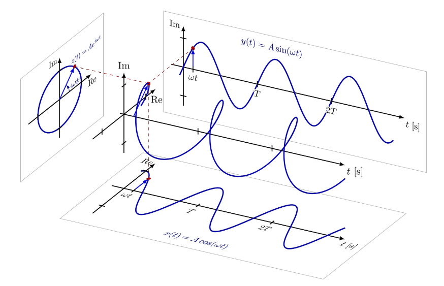
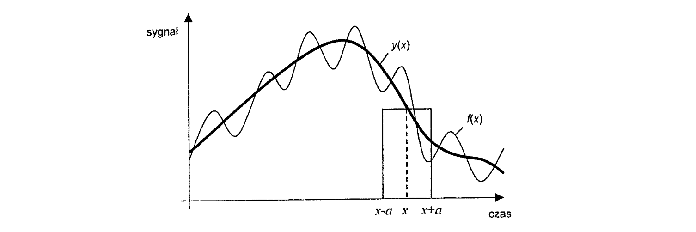
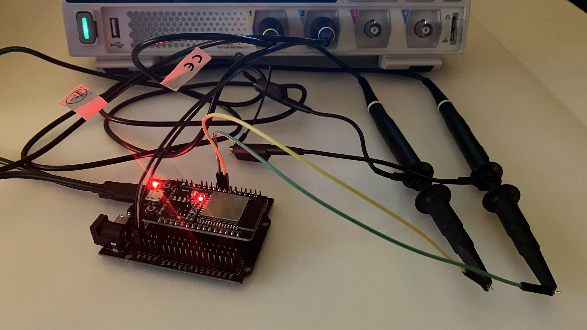
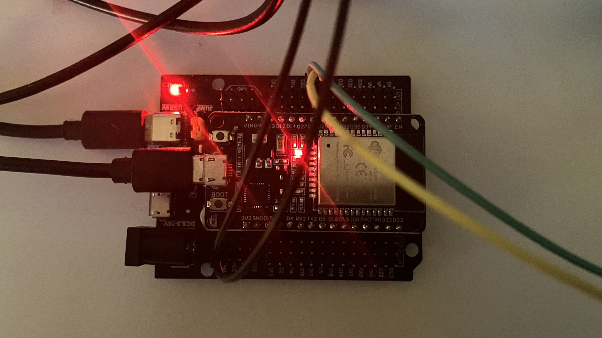
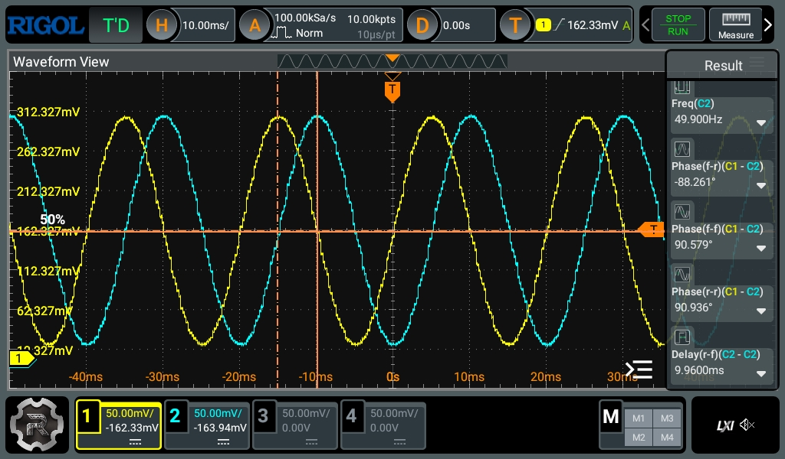
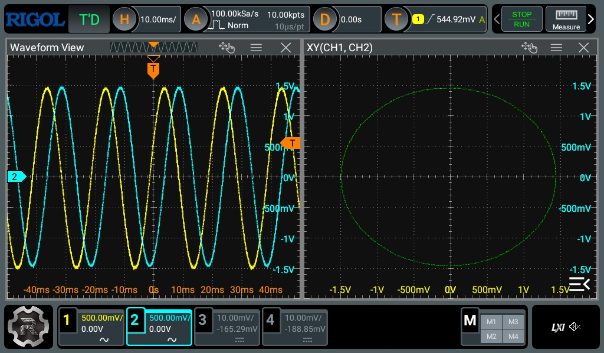
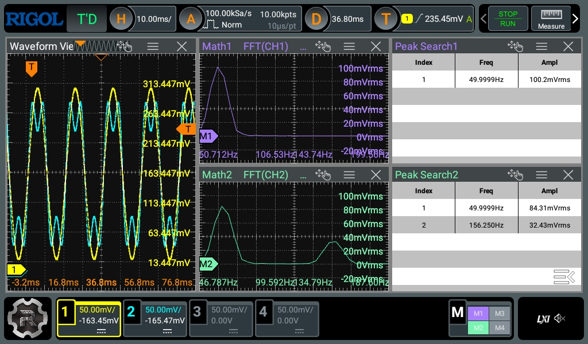
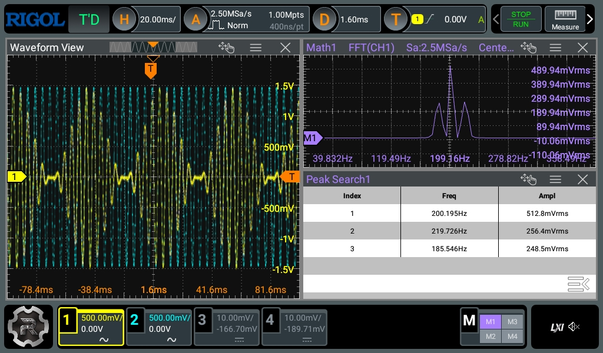

import { Callout } from 'nextra/components'

Mój poprzedni wpis poświęcony był twardym zagadnieniom inżynierii oprogramowania. W tym wpisie chciałbym wrócić nieco do
korzeni i początków mojej studenckiej drogi, czyli do teorii obwodów, oraz pokazać, w jaki sposób wiąże się ona z dosyć
zaawansowanymi tematami analizy Fouriera, której fundamenty teoretyczne, omawiane w tym wpisie, wykorzystałem w niedawno
obronionej przeze mnie [pracy magisterskiej](https://github.com/milosz08/master-thesis), poświęconej nadpróbkowanej
transformacji falkowej.

Każdy, kto uczył się teorii obwodów, pamięta (albo nie pamięta) moment przejścia z równania różniczkowego dla stanów
nieustalonych do metody symbolicznej opartej na liczbach zespolonych (słynne $j\omega$). W tym (możliwie, że dość
przydługawym) wpisie postaram się krok po kroku wytłumaczyć (opartego o wzór Eulera) moment tego przejścia oraz w jaki
sposób przejście to wiąże się z teorią splotu analizy Fouriera.

Pod koniec przedstawię *namacalne* wyniki wcześniej przedstawionych dywagacji teoretycznych z użyciem prostego
generatora sygnałów opartego o ESP32 i analizy widmowej.

Tworzę ten wpis z nadzieją, że pomoże on, choć w minimalnym stopniu osobom zaczynającym swoją przygodę na studiach
inżynierskich zrozumieć nieco tajniki teorii obwodów, które na pierwszy rzut oka może wydać się skomplikowana. Zakładam,
że czytelnik ma podstawową wiedzę z zakresu równań różniczkowych pierwszego rzędu oraz liczb zespolonych na płaszczyźnie
zespolonej.

## Świat rzeczywisty (równanie różniczkowe) a świat inżynierski (liczby zespolone) w modelowaniu układu dynamicznego L

Najlepszym sposobem, aby przedstawić zależność między operacją różniczkowania a opisem z wykorzystaniem liczb
zespolonych, jest element reaktancyjny dla prądu przemiennego. Weźmy więc na warsztat cewkę (element L). Jej opis
matematyczny to różniczkowanie prądu (a więc opis jak szybko zmienia się prąd). Dla funkcji czasu równaniem opisującym
tę zależność byłoby:

$$
u(t) = L \frac{d}{dt}i(t)
$$

gdzie $u(t)$ oraz $i(t)$ to odpowiednio funkcje napięcia i prądu, zmieniające się w czasie $t$. Potraktujmy ten układ
jako model układu dynamicznego. Jeśli wymusimy prąd sinusoidalny (a więc założony z początku prąd przemienny), dla
którego $i(t)=\cos(\omega t)$, gdzie $\omega=2\pi f$, to zgodnie z regułami liczenia pochodnych otrzymamy:

$$
u(t) = -\omega L\sin(\omega t)
$$

Otrzymaliśmy wynik matematycznie poprawny, ale jest on w sinusie, a prąd chcemy mierzyć w cosinusie. Żeby porównać te
dwa sygnały (i tym samym zobaczyć przesunięcie fazy) trzeba zmienić sinus z powrotem na cosinus, z użyciem tożsamości
trygonometrycznej:

$$
-\sin(x) = \cos\left(x + \frac{\pi}{2}\right)
$$

gdzie finalnie podstawiając, otrzymamy:

$$
u(t) = \omega L \cos\left(\omega t + \frac{\pi}{2}\right)
$$

Wygląda prosto, ale mimo wszystko jest to prosty układ, posiadający jedynie jeden element reaktancyjny. Dla układu
składającego się z wielu elementów pasywnych (rezystor, cewka, kondensator) sumowanie funkcji sinus i cosinus w
dziedzinie czasu to dosyć skomplikowana i żmudna praca.

### Przejście do świata liczb zespolonych

Rozwiążmy teraz ten sam układ, ale z wykorzystaniem wzoru Eulera, a więc: $e^{j\phi}=\cos(\phi)+j\sin(\phi)$, gdzie
$\phi$ to zadany kąt. Jeśli za kąt $\phi$ podstawimy kąt zmieniający się w czasie (a więc $\phi = \omega t$) otrzymamy
wówczas:

$$
e^{j\omega t}=\cos(\omega t)+j\sin(\omega t)
$$

gdzie samo $e^{j\omega t}$ możemy interpretować jako wektor o długości 1, który kręci się w kółko na płaszczyźnie
zespolonej z prędkością $\omega$. Reprezentację graficzną funkcji $e^{j\omega t}$ przedstawiono poniżej
([źródło](https://mfcl.tistory.com/47)):



Zacznijmy wywód od części rzeczywistej, a więc funkcji: $i_{\mathfrak{Re}}(t)=\cos(\omega t)$. Wprowadźmy teraz sygnał
pomocniczy (a więc urojony) $i_{\mathfrak{Im}}=j\sin(\omega t)$. Robimy to, aby uzupełnić cosinus do pełnej postaci
wykładniczej, na której łatwiej wykonuje się operacje matematyczne. W ostatecznym rozrachunku, podstawiając, otrzymamy
nowy sygnał $i(t)$ który jest bezpośrednią reprezentacją wzoru Eulera:

$$
i(t)=\cos(\omega t)+j\sin(\omega t)=e^{j\omega t}
$$

Zauważmy idealną zgodność: w metodzie symbolicznej sygnał fizyczny utożsamiamy z częścią rzeczywistą ($\mathfrak{Re}$)
wirującego wektora. Skoro $e^{j\omega t}=\cos(\omega t)+j\sin(\omega t)$, to funkcja wymuszenia $i(t)=\cos(\omega t)$
jest po prostu częścią rzeczywistą tego zapisu. Zauważmy również, że prąd $i(t)$ to tak naprawdę funkcja
$e^{j\omega t}$. Cała idea tego podstawienia polega na wykorzystaniu funkcji Eulera przy liczeniu pochodnej. Jako że
pochodna z funkcji $e^x$ to po prostu ta funkcja, upraszcza to drastycznie obliczenia:

$$
\frac{d}{dt}i(t)=\frac{d}{dt}\left(e^{j\omega t}\right)=j\omega e^{j\omega t}
$$

gdzie całość ostatecznie sprowadza się do prostego mnożenia (zgodnie z prawem Ohma):

$$
u(t)=i(t)j\omega L
$$

co finalnie daje tę *mistyczną* wartość impedancji cewki oznaczanej w literaturze często właśnie jako $Z_L=j\omega L$.

Należy mieć na uwadze, że powyższy trik działa jedynie dla systemów liniowych (a więc takich, które nie mieszają części
rzeczywistej z urojoną), czyli jeśli $A'=X$ oraz $(jB)'=Y$ to:

$$
(A+jB)'\Leftrightarrow (X+jY)
$$

W systemach nieliniowych (np. w układach chaotycznych, opisanych przeze mnie
[w tym wpisie](/szyfrowanie-obrazów-z-wykorzystaniem-chaotycznego-atraktora-lorenza)) sytuacja się komplikuje, ale to
temat wykraczający poza obszar tematyczny wyżej przedstawianego wywodu.

### Przejście na liczby rzeczywiste jako dowód tożsamości

Wróćmy natomiast jeszcze do wzoru $u(t)=\omega L \cos\left(\omega t+\frac{\pi}{2}\right)$. Na pierwszy rzut oka wynik
uzyskany metodą klasyczną oraz metodą symboliczną (mnożenie przez $j\omega$) mogą wydawać się różnymi opisami tego
samego zjawiska. Mimo różnic w zapisie oba te wyniki są matematycznie tożsame, a mnożenie przez $j$ jest bezpośrednim
odpowiednikiem przesunięcia fazy o kąt $\frac{\pi}{2}$. Kluczem do zrozumienia tego przekształcenia jest zależność:

$$
j=e^{j\frac{\pi}{2}}
$$

która po podstawieniu do $u(t)=i(t)j\omega L$, dla którego $i(t)=e^{j\omega t}$ da w rezultacie:

$$
u(t)=\left(e^{j\frac{\pi}{2}}\omega L\right)e^{j\omega t}
$$

Korzystając z własności potęgowania ($e^ae^b=e^{a+b}$), można pogrupować wyrazy zależne od wykładnika:

$$
u(t)=(\omega L)e^{j\left(\omega t+\frac{\pi}{2}\right)}
$$

gdzie otrzymane wyrażenie zespolone opisuje wirujący wektor. Aby odzyskać przebieg czasowy sygnału rzeczywistego,
zgodnie z przyjętą wcześniej konwencją, trzeba wyciągnąć część rzeczywistą, a ponieważ
$\mathfrak{Re}\{e^{j\phi}\}=\cos(\phi)$, to wynikowo jest to po prostu cosinus:

$$
u_{\mathfrak{Re}}(t)=\mathfrak{Re}\left\{(\omega L)e^{j\left(\omega t+\frac{\pi}{2}\right)}\right\}
=\omega L\cos\left(\omega t+\frac{\pi}{2}\right)
$$

co dowodzi, że zarówno $u(t)$ uzyskane w wyniku klasycznej operacji różniczkowania w dziedzinie czasu, oraz część
rzeczywista metody symbolicznej są sobie równe.

## Upraszczanie splotu z wykorzystaniem liczb zespolonych i transformacji Fouriera

Poprzednie kroki to był jedynie wstęp do zrozumienia, jak wzór Eulera pozwala uniknąć bezpośredniego różniczkowania.
Teraz chciałbym to przenieść w świat transformacji Fouriera i jednego z jej twierdzeń, a mianowicie twierdzenia o
splocie, szeroko wykorzystywanym w DSP i analizie sygnałów. Większość kursów (w tym na moich studiach) podaje go jako
*prawdę objawioną* do przysłowiowego *wykucia na pamięć*. Ja postaram się pokazać krok po kroku, w jaki sposób
*koszmar całkowy* dziedziny czasu zamienia się w proste mnożenie w dziedzinie częstotliwości.

Zacznijmy zatem od przypomnienia sobie definicji splotu. Wyobraźmy sobie, że przepuszczamy sygnał $x(t)$ przez filtr o
odpowiedzi impulsowej $h(t)$. W dziedzinie czasu wynikowy sygnał $y(t)$ jest splotem (konwolucją) tych dwóch funkcji.
Matematycznie jest to po prostu całka:

$$
y(t)=x(t)*h(t)=\int_{-\infty}^{\infty}x(\tau)h(t-\tau)d\tau
$$

w której jedna funkcja jest przesuwana względem drugiej. Graficzne przedstawienie splotu, którego całka jest ograniczona
przedziałem dolnym $x-a$ oraz przedziałem górnym $x+a$ przedstawiono na poniższej ilustracji (z książki pt. "Metody
cyfrowego przetwarzania obrazów", W. Malina, M. Smiatacz). Splot ten reprezentuje filtrację sygnału opisanego funkcją
$f(x)$ z wykorzystaniem skończonego filtra $h(t)$ (prostokąt):



Jak można zauważyć, obliczanie splotu analitycznie dla skomplikowanych sygnałów jest katorgą (nie wspominając już o
domenie przestrzennej i obrazach, gdzie całka zamienia się w całkę podwójną). Znacznie prościej liczy się splot w
domenie częstotliwości:

$$
Y(\omega)=X(\omega)H(\omega)
$$

gdzie funkcje $Y(\omega)$, $X(\omega)$ oraz $H(\omega)$ to odpowiedniki funkcji czasu w dziedzinie częstotliwości.

Jak zatem przekształcić ten zapis z dziedziny czasu na dziedzinę częstotliwości? Tutaj właśnie wykorzystywana jest
transformacja Fouriera określona wzorem:

$$
\mathcal{F}\{f(t)\}=\int_{-\infty}^{\infty}f(t)e^{-j\omega t}\,dt
$$

gdzie $e^{-j\omega t}$ to nasza funkcja Eulera przytoczona we wcześniejszym podrozdziale a $f(t)$ to badany sygnał.
Podstawmy więc transformację do splotu w dziedzinie czasu:

$$
Y(\omega)=\mathcal{F}\left\{\int_{-\infty}^{\infty}x(\tau)h(t-\tau)d\tau\right\}
=\int_{-\infty}^{\infty}\left[\int_{-\infty}^{\infty}x(\tau)h(t-\tau)d\tau\right]e^{-j\omega t}\,dt
$$

Mając takie dwie całki i zakładając, że sygnał spełnia warunki Dirichleta (w dużym skrócie jest bezwzględnie całkowalny,
zainteresowanych warunkami odsyłam do literatury) można zamienić kolejność całkowania:

$$
Y(\omega)=\int_{-\infty}^{\infty}x(\tau)\left[\int_{-\infty}^{\infty}h(t-\tau)e^{-j\omega t}\,dt\right]d\tau
$$

Skupmy się na tej wewnętrznej całce. Zmienną jest tam $t$. Zróbmy więc podstawienie, żeby pozbyć się $(t-\tau)$. Niech
nowa zmienna $u=t-\tau$. Wtedy $t=u+\tau$ (bo $\tau$ traktujemy jako stałą w tej wewnętrznej całce) oraz $dt=du$.
Podstawiając, otrzymujemy więc:

$$
\int_{-\infty}^{\infty}h(u)e^{-j\omega (u+\tau)}\,du
$$

Wykorzystując wcześniej przytoczoną właściwość potęg ($e^{a+b}=e^ae^b$) rozbijmy wykładnik:

$$
\int_{-\infty}^{\infty}h(u)e^{-j\omega u}e^{-j\omega\tau}\,du
$$

Biorąc pod uwagę fakt, że $e^{-j\omega\tau}$ nie zależy od $u$, możemy potraktować go jako stałą ostatecznie otrzymując
$H(\omega)$ jako odpowiedź impulsowa układu w dziedzinie częstotliwości:

$$
e^{-j\omega\tau}\int_{-\infty}^{\infty}h(u)e^{-j\omega u}\,du=e^{-j\omega\tau}H(\omega)
$$

Podstawmy więc $H(\omega)$ do pierwotnego równania $Y(\omega)$:

$$
Y(\omega)=\int_{-\infty}^{\infty}x(\tau)\left[e^{-j\omega\tau}H(\omega)\right]d\tau
$$

Wówczas $H(\omega)$ jest stałą względem $\tau$, więc można przenieść ją przed całkę główną, otrzymując ostatecznie
równanie prostego mnożenia, co kończy dowód.

$$
Y(\omega)=H(\omega)\int_{-\infty}^{\infty}x(\tau)e^{-j\omega\tau}\,d\tau=H(\omega)X(\omega)
$$

## Zależność między Fourierem a cewką z teorii obwodów

Wróćmy jeszcze do cewki z początku tego wpisu opisanej równaniem $u(t)=L\frac{d}{dt}i(t)$. Okazuje się, że to również
jest splot. Różniczkowanie sygnału to matematycznie splot tego sygnału z pochodną (w sensie dystrybucji) delty Diraca.
Ale po kolei. Zamodelujmy sobie nasz obwód z elementem L jako układ dynamiczny z wejściem $i(t)$ oznaczającym prąd oraz
wyjściem $u(t)$ oznaczającym napięcie. Zadaniem takiego układu jest zróżniczkowanie wartości prądu i przemnożenie przez
stałą $L$. W teorii systemów operacja wykonywana przez układ dynamiczny może zostać opisana jako splot sygnału
wejściowego z odpowiedzią impulsową $h(t)$:

$$
u(t)=i(t)*h(t)
$$

Musimy jakoś znaleźć wartość $h(t)$ a więc odpowiedź impulsową cewki z założeniem, że cewka różniczkuje. Tutaj właśnie
przydaje się delta Diraca $\delta(t)$ i jej właściwości:

* tożsamości: $f(t)*\delta(t)=f(t)$,
* pochodnej splotu: $\frac{d}{dt}f(t)=\frac{d}{dt}(f(t)*\delta(t))=f(t)*\frac{d}{dt}\delta(t)$.

Dzięki tym właściwościom wiemy, że aby zróżniczkować funkcję $f(t)$ za pomocą splotu, należy spleść ją z pochodną delty
Diraca, a zatem odpowiedź impulsowa dla cewki to:

$$
h_{\text{L}}(t)=L \frac{d}{dt}\delta (t)
$$

Jako że chcemy sobie uprościć życie, przejdźmy na dziedzinę częstotliwościową. Jak wiemy, splot w dziedzinie widmowej
przyjmuje postać: $Y(\omega)=X(\omega)H(\omega)$. Podstawmy więc nasze dane opisujące model dynamiczny układu
reaktancyjnego:

$$
U(\omega)=I(\omega)\mathcal{F}\{h_{\text{L}}(t)\}
$$

Zakładając, że transformata Fouriera delty Diraca to po prostu 1 ($\mathcal{F}\{\delta(t)\}=1$) oraz znając
twierdzenie o różniczkowaniu transformacji Fouriera:

$$
\mathcal{F}\left\{\frac{d}{dt}x(t)\right\}=j\omega X(\omega)
$$

<Callout type="info">
  Podobne twierdzenie (ale dla pochodnej cząstkowej 2 rzędu) zastosowałem w dowodzie mojej
  [pracy magisterskiej](https://github.com/milosz08/master-thesis) dotyczącym wykrywania nieciągłości w obrazach
  cyfrowych z wykorzystaniem analizy Fouriera i jej relacji do operatora Laplace'a. Zainteresowanych odsyłam do wywodu.
</Callout>

po zastosowaniu jego do pochodnej delty Diraca otrzymamy:

$$
\mathcal{F}\left\{\frac{d}{dt}\delta(t)\right\}=j\omega\mathcal{F}\{\delta(t)\}=j\omega
$$

Jeśli zastosujemy powyższą właściwość do układu reaktancyjnego, to wówczas otrzymamy:

$$
U(\omega)=I(\omega)(j\omega L)
$$

a więc transmitancja $H(\omega) = j\omega L$. Jak widać, otrzymany wynik transmitancji jest identyczny z wcześniejszymi
wywodami impedancji $Z_L$.

## Eksperymenty i stanowisko pomiarowe

Rolę generatora sygnałów DIY przejęło moje 30 pinowe ESP32 (dokładnie ESP-WROOM-32) na podstawce do prototypowania,
zasilane z USB-C. Z uwagi na zachowanie prostoty oprogramowania prototypów, wykorzystałem arduino IDE i driver do płytki
ESP32. Wykorzystany oscyloskop to RIGOL DHO 804 (pasmo 70 MHz, 12-bitowy, próbkowanie 1.25 Gsa/s) z dwoma sondami x10.
Sondy podłączone do wspólnej masy (GND), sonda żółta (CH1) podłączona do wyjścia DAC 25, sonda niebieska (CH2)
podłączona do wyjścia DAC 26.

Dla uproszczenia sygnał z DAC jest podawany bezpośrednio na sondę. Zgodnie ze sztuką inżynierską należałoby użyć
prostego filtra RC, aby wygładzić szum kwantyzacji wynikający z cyfrowej natury sygnału, jednak przy tak niskich
częstotliwościach (50-200Hz) i przy tej rozdzielczości oscyloskopu efekt ten jest pomijalny dla poniższych eksperymentów.




### Eksperyment 1: Pochodna to przesunięcie fazy (mnożenie przez $j$)

Poniższy kod generuje dwa sygnały przesunięte względem siebie o 90 stopni ($\frac{\pi}{2}$). Pin 25 (DAC1) pokazuje
część rzeczywistą równania $e^{j\omega t}$, a więc cosinus a pin 26 (DAC2) część urojoną a zatem sinus.

```cpp
#include <Arduino.h>

#define DAC1 25
#define DAC2 26

const float freq_base = 50.0;  // 50Hz
const float amplitude = 120.0; // amplituda, max rozdzielczość +-128 +-margines
const float offset = 128.0;    // przesunięcie, żeby nie ucinało dołu

void setup()
{
}

void loop()
{
  float t = micros() / 1000000.0;

  // w=2*pi*f
  float w_t = 2.0 * PI * freq_base * t;

  // e^(jwt)=cos(wt)+j*sin(wt)

  // część rzeczywista (napięcie)
  int val_cos = offset + amplitude * cos(w_t);

  // część urojona (prąd)
  int val_sin = offset + amplitude * sin(w_t);

  // zapis do DAC
  dacWrite(DAC1, val_cos);
  dacWrite(DAC2, val_sin);
}
```

Na poniższym rysunku widać wyraźnie, że sygnał żółty to cosinus (zaczyna się od 0) a sygnał niebieski to sinus
(przesunięty). Dodatkowo korzystając z trybu `phase` przesunięcie miedzy sygnałami wynosi $\approx 90^\circ$, a zatem
po przeliczeniu na radiany przesunięcie równe jest $\frac{\pi}{2}$.



Poniżej przedstawiono również tryb X-Y. Oś pozioma to cosinus (cześć rzeczywista), a oś pionowa to sinus (część
urojona). Po połączeniu tych wartości w jeden punkt dla każdej chwili $t$ kreślą one idealny okrąg. Ten okrąg to nic
innego jak wektor $e^{j\omega t}$. Stanowi to dowód, że abstrakcyjna liczba zespolona $j$ objawia się jako fizyczne
przesunięcie fazy o $90^\circ$ zmieniając liniowy ruch góra-dół w ruch obrotowy.



### Eksperyment 2: Sumowanie w czasie to szereg Fouriera w widmie

W tym eksperymencie zbudowany został programowo przebieg odkształcony. Zgodnie z teorią Fouriera, każdy okresowy sygnał
niebędący sinusoidą jest w rzeczywistości sumą nieskończonej liczby sinusoid (harmonicznych). Więcej o tym znajdziesz w
[innym moim wpisie](/podstawy-przetwarzania-i-analizy-częstotliwościowej-sygnału-audio).

Szczególnym pojęciem, jakie należy tutaj wprowadzić, jest liniowość transformacji Fouriera. Właściwość ta mówi, że widmo
sumy sygnałów jest równe sumie ich widm i prezentuje się jako zależność:

$$
\mathcal{F}\left\{\sum_{n}a_nx_n(t)\right\}=\sum_{n}a_n X_n(\omega)
$$

Pokrótce oznacza to, że dodając w kodzie $n$-tą harmoniczną, nie wpływamy na sygnał podstawowy.

Poniższy kod na kanale DAC1 generuje idealnie czystą sinusoidę 50 Hz. Na kanale DAC2 realizowana jest superpozycja
(sumowanie) w dziedzinie czasu: do podstawowej sinusoidy 50 Hz dodawana jest trzecia harmoniczna ($3f$) o mniejszej
amplitudzie.

```cpp
#include <Arduino.h>

#define DAC1 25
#define DAC2 26

const float freq_base = 50.0;
const float offset = 128.0;

void setup()
{
}

void loop()
{
  float t = micros() / 1000000.0;
  float w_t = 2.0 * PI * freq_base * t;

  // kanał 1: podstawowy sin 50Hz
  float signal1 = 120.0 * sin(w_t);

  // kanał 2: sumowanie sygnału o mniejszej amplitudzie z sygnałem podstawowym
  float signal2 = (100.0 * sin(w_t)) + (40.0 * sin(3.0 * w_t));

  // konwersja na zakres 0-255
  int out1 = (int)(offset + signal1);
  int out2 = (int)(offset + signal2);

  // przycinanie, żeby nie wyjść poza zakres DAC (0-255)
  if (out1 > 255) out1 = 255; if (out1 < 0) out1 = 0;
  if (out2 > 255) out2 = 255; if (out2 < 0) out2 = 0;

  dacWrite(DAC1, out1);
  dacWrite(DAC2, out2);
}
```

Na poniższym rysunku widać w dziedzinie czasu czystą sinusoidę 50 Hz (żółty przebieg) oraz przebieg odkształcony (kolor
niebieski). Operacja FFT wykonywana była dla amplitudy w skali liniowej (w celu czystego obrazu prążków) wraz z oknem
Hanninga. Analizując widmo żółtego przebiegu, widać jeden dominujący prążek w granicach 50 Hz. Natomiast w widmie
przebiegu odkształconego (niebieskiego) wykryte zostały dwa prążki: jeden podstawowy (około 50 Hz) oraz drugi,
odpowiadający trzeciej harmonicznej (około 156 Hz, co stanowi w przybliżeniu trzykrotność częstotliwości podstawowej).
Potwierdza to liniowość transformacji Fouriera: dodawanie w czasie skutkuje pojawieniem się niezależnych prążków w
widmie.



Co ciekawe, zachowane zostały proporcje amplitud zdefiniowane w kodzie. W programie stosunek amplitud wynosi 100:40,
czyli 2.5. Pomiary oscyloskopowe pokazują 855.6 mVrms dla składowej podstawowej oraz 329 mVrms dla trzeciej
harmonicznej. Stosunek ten wynosi $\frac{855.6 mVrms}{329 mVrms}\approx 2.6$, co potwierdza, że DAC w ESP32 zachowuje
liniowość.

### Eksperyment 3: Mnożenie sygnałów (modulacja amplitudy)

W poprzednim kroku pokazano, że sumowanie sygnałów w czasie (splot) ma swoje odzwierciedlenie w widmie. Skoro splot w
dziedzinie czasu odpowiada mnożeniu w domenie częstotliwości, to czy twierdzenie to działa w drugą stronę? Okazuje się,
że tak i nazywane jest modulacją amplitudy (ang. *amplitude modulation*, AM).

<Callout>
  Modulacja amplitudy (AM) była niegdyś szeroko wykorzystywana w transmisji radiofonii naziemnej (stąd popularna nazwa
  radio AM). Obecnie prawie całkowicie (a przynajmniej w Europie) została wyparta przez modulację częstotliwościową
  (ang. *frequency modulation*, FM) z uwagi na lepszą odporność na zakłócenia sygnału i szersze pasmo.
</Callout>

Aby to sprawdzić, w poniższym eksperymencie programowo pomnożono przez siebie dwa sinusy: szybki sygnał nośny (carrier)
o częstotliwości 200 Hz oraz wolny sygnał modulujący o częstotliwości 20 Hz. Zgodnie z teorią, iloczyn dwóch sinusów
powinien *rozszczepić* widmo, tworząc nowe prążki częstotliwości (wstęgi boczne), oddalone od nośnej dokładnie o
częstotliwość modulującą.

```cpp
#include <Arduino.h>

#define DAC1 25
#define DAC2 26

const float freq_carrier = 200.0; // nośna
const float freq_mod = 20.0;      // modulująca

void setup()
{
}

void loop()
{
  float t = micros() / 1000000.0;

  // obliczenie faz
  float w_c = 2.0 * PI * freq_carrier * t;
  float w_m = 2.0 * PI * freq_mod * t;

  // sygnały bazowe
  float carrier = sin(w_c);
  float modulator = sin(w_m);

  // modulacja AM (1 + m * sin(wm * t)) * sin(wc * t)
  float signal_am = (1.0 + modulator) * carrier;

  // skalowanie do zakresu -0.5 do 0.5 i offset 128
  int out1 = 128 + (int)(signal_am * 60.0);

  // czysta nośna
  int out2 = 128 + (int)(carrier * 120.0);

  if (out1 > 255) out1 = 255; if (out1 < 0) out1 = 0;
  if (out2 > 255) out2 = 255; if (out2 < 0) out2 = 0;

  dacWrite(DAC1, out1);
  dacWrite(DAC2, out2);
}
```

Analizując widmo FFT przedstawione na rysunku poniżej, zamiast jednego prążka widoczne są 3 (charakterystyczne właśnie
dla modulacji AM). Środkowy prążek (200.2 Hz) to fala nośna, a symetrycznie po jej bokach widoczne są dwa nowe prążki
(wstęgi boczne) oddalone o częstotliwość modulującą, około 20 Hz.



Zgodnie z teorią modulacji, amplituda wstęg bocznych powinna wynosić dokładnie połowę amplitudy fali nośnej. Podobnie
jak dla wyników z poprzedniego eksperymentu, wartości amplitudy zachowują niemal idealne proporcje (amplituda fali
nośnej: około 512.8 mVrms, amplitudy wstęg bocznych: około 256.4 mVrms). Stosunek ten wynosi w dużym przybliżeniu 2.0,
stanowiąc potwierdzenie wcześniej przytoczonej teorii.

## Podsumowanie

Niniejszy wpis stanowił próbę syntezy teoretycznych podstaw analizy z praktyką inżynierską. Pokazałem drogę od
wyprowadzenia wzoru Eulera, przez analizę operacji splotu, aż po sprzętową weryfikację postawionych tez. Wnioski płynące
z przedstawionych rozważań można sprowadzić do trzech głównych zagadnień:

* W teorii obwodów jednostka urojona $j$ nie jest jedynie abstrakcją matematyczną, lecz operatorem różniczkowania w
  dziedzinie czasu. To, co w płaszczyźnie zespolonej interpretujemy jako rotację wektora, w rzeczywistych pomiarach
  sygnałów objawia się jako fizyczne przesunięcie fazowe o $90^\circ$ ($\frac{\pi}{2}$).
* Transformacja Fouriera pozwala na zamienne stosowanie operacji matematycznych w zależności od dziedziny. Wykazano, że
  skomplikowana obliczeniowo operacja splotu w dziedzinie czasu jest równoważna prostemu mnożeniu w dziedzinie
  częstotliwości. Zależność ta działa również w sposób odwrotny: mnożenie sygnałów w czasie (modulacja amplitudowa)
  skutkuje splotem ich widm.

Mam nadzieję, że przedstawione dowody i symulacje, choć w minimalnym stopniu, pomogą w głębszym zrozumieniu relacji
między równaniami różniczkowymi, podstawami teorii obwodów a analizą widmową, stanowiąc fundament do dalszej pracy z
cyfrowym przetwarzaniem sygnałów, której zgłębianie serdecznie zachęcam. Zainteresowanych zapraszam również do
zapoznania się z moją [pracą magisterską](https://github.com/milosz08/master-thesis) przedstawiającą nieco bardziej
zaawansowane zagadnienia DSP (m.in. okienkowanie transformacji Fouriera i analizę falkową) w zagadnieniach wykrywania
punktów nieciągłości obrazów cyfrowych.

Standardowo, zapraszam do dzielenia się przemyśleniami i spostrzeżeniami w komentarzach.
